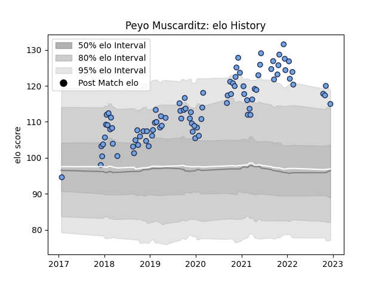

---  
layout: page  
title: Peyo Muscarditz  
date: 2022-12-14 11:21:41.143124  
categories: player  
---
# Peyo Muscarditz

## Positions: C

## Current elo: 115.0

## Current Percentile: 95.0

# Elo History

# Match History

| Team    |   Appearances |   Win Rate |
|:--------|--------------:|-----------:|
| Bayonne |            90 |   0.511111 |

| Opponent             |   Matches |   Win Rate |
|:---------------------|----------:|-----------:|
| Agen                 |         5 |   0.8      |
| Stade Toulousain     |         5 |   0.6      |
| Brive                |         5 |   0.5      |
| Clermont Auvergne    |         4 |   0.5      |
| Stade Francais Paris |         4 |   0.5      |
| Nevers               |         4 |   0.375    |
| Narbonne             |         4 |   0.75     |
| Montpellier Herault  |         4 |   0.5      |
| Vannes               |         4 |   0.75     |
| Colomiers            |         3 |   0.666667 |
| Carcassonne          |         3 |   0.666667 |
| Provence Rugby       |         3 |   0.666667 |
| Biarritz Olympique   |         3 |   0        |
| Beziers              |         3 |   0.333333 |
| La Rochelle          |         3 |   0.333333 |
| US Bressane          |         3 |   1        |
| Toulon               |         2 |   0.5      |
| London Irish         |         2 |   0.5      |
| Lyon                 |         2 |   0        |
| Aurillac             |         2 |   1        |
| Montauban            |         2 |   1        |
| Castres Olympique    |         2 |   0        |
| Grenoble             |         2 |   0        |
| Oyonnax              |         2 |   0.5      |
| Pau                  |         2 |   0        |
| Scarlets             |         2 |   0        |
| Racing 92            |         2 |   1        |
| Rouen                |         1 |   1        |
| Bordeaux Begles      |         1 |   0        |
| Perpignan            |         1 |   0        |
| Dax                  |         1 |   0.5      |
| Mont-de-Marsan       |         1 |   0.5      |
| Leicester Tigers     |         1 |   0        |
| Gloucester Rugby     |         1 |   0        |
| Massy                |         1 |   1        |