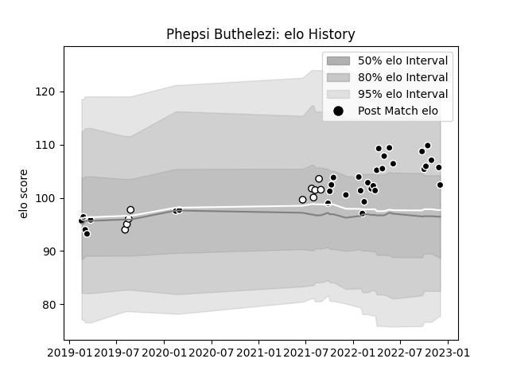

---  
layout: page  
title: Phepsi Buthelezi  
date: 2022-12-14 11:27:47.646447  
categories: player  
---
# Phepsi Buthelezi

## Positions: N8, FL

## Current elo: 105.0

## Current Percentile: 68.0

# Elo History

# Match History

| Team         |   Appearances |   Win Rate |
|:-------------|--------------:|-----------:|
| Sharks       |            34 |   0.602941 |
| Natal Sharks |            10 |   0.7      |

| Opponent            |   Matches |   Win Rate |
|:--------------------|----------:|-----------:|
| Bulls               |         5 |   0.4      |
| Stormers            |         3 |   0.166667 |
| Zebre               |         2 |   1        |
| Golden Lions        |         2 |   1        |
| Lions               |         2 |   1        |
| Leinster            |         2 |   0.5      |
| Blue Bulls          |         2 |   1        |
| Griquas             |         2 |   0.5      |
| Glasgow Warriors    |         2 |   0.5      |
| Free State Cheetahs |         2 |   1        |
| Dragons             |         2 |   1        |
| Cardiff Blues       |         2 |   0        |
| Ospreys             |         2 |   1        |
| Pumas               |         1 |   0        |
| Sunwolves           |         1 |   1        |
| Ulster              |         1 |   0        |
| Western Province    |         1 |   0        |
| Scarlets            |         1 |   1        |
| Queensland Reds     |         1 |   1        |
| Benetton Treviso    |         1 |   1        |
| Munster             |         1 |   0        |
| Melbourne Rebels    |         1 |   1        |
| Harlequins          |         1 |   1        |
| Edinburgh           |         1 |   0        |
| Connacht            |         1 |   1        |
| Blues               |         1 |   1        |
| Hurricanes          |         1 |   0        |