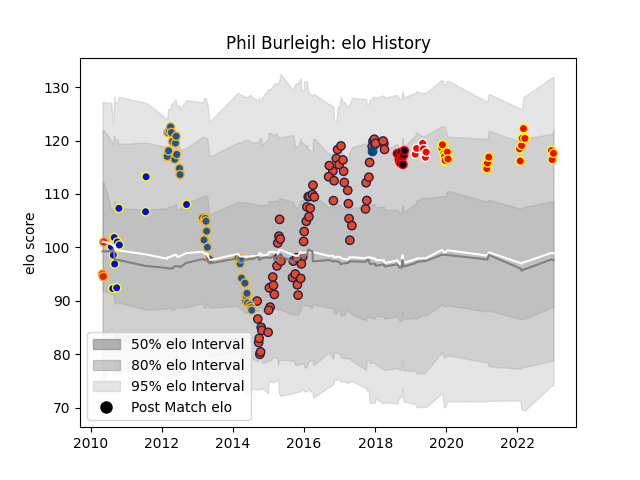

---  
layout: page  
title: Phil Burleigh  
date: 2023-01-13 11:30:37.809413  
categories: player  
---
# Phil Burleigh

## Positions: C, FH

## Country: Scotland

## Current elo: 118.0

## Current Percentile: 84.0

# Elo History

# Match History

| Team          |   Appearances |   Win Rate |
|:--------------|--------------:|-----------:|
| Edinburgh     |            73 |   0.513699 |
| Highlanders   |            33 |   0.424242 |
| Kyuden Voltex |            20 |   0.4      |
| Bay of Plenty |            12 |   0.5      |
| Canterbury    |            10 |   0.7      |
| Sunwolves     |             7 |   0.142857 |
| Chiefs        |             3 |   0        |
| Scotland      |             1 |   1        |

| Opponent                         |   Matches |   Win Rate |
|:---------------------------------|----------:|-----------:|
| Glasgow Warriors                 |         8 |   0.625    |
| Ulster                           |         7 |   0.285714 |
| Scarlets                         |         7 |   0.5      |
| Hurricanes                       |         6 |   0.5      |
| Blues                            |         6 |   0.5      |
| Dragons                          |         6 |   0.666667 |
| Connacht                         |         6 |   0.333333 |
| Chiefs                           |         6 |   0.5      |
| Zebre                            |         5 |   0.6      |
| Ospreys                          |         5 |   0.6      |
| Leinster                         |         5 |   0.2      |
| Queensland Reds                  |         4 |   0        |
| Crusaders                        |         4 |   0.25     |
| North Harbour                    |         3 |   1        |
| New South Wales Waratahs         |         3 |   0.333333 |
| Shimizu Blue Sharks              |         3 |   0.666667 |
| Munster                          |         3 |   0.333333 |
| Stormers                         |         3 |   0        |
| Toyota Industries Shuttles Aichi |         3 |   0        |
| Auckland                         |         3 |   0        |
| London Irish                     |         3 |   1        |
| Cardiff Blues                    |         3 |   0        |
| Benetton Treviso                 |         3 |   0.666667 |
| Chugoku Red Regulions            |         3 |   1        |
| Counties Manukau                 |         3 |   0.666667 |
| Brumbies                         |         3 |   0        |
| Melbourne Rebels                 |         2 |   0.5      |
| Otago                            |         2 |   1        |
| Southern Kings                   |         2 |   1        |
| Harlequins                       |         2 |   1        |
| Coca-Cola Red Sparks             |         2 |   0        |
| Munakata Sanix Blues             |         2 |   0        |
| Sharks                           |         2 |   0.5      |
| Lyon                             |         2 |   0.5      |
| Taranaki                         |         2 |   0.5      |
| Tasman                           |         2 |   0.5      |
| Bordeaux Begles                  |         2 |   1        |
| Kurita Water Gush                |         2 |   0.5      |
| Bulls                            |         1 |   1        |
| Southland                        |         1 |   1        |
| Waikato                          |         1 |   0        |
| Wellington                       |         1 |   1        |
| Western Force                    |         1 |   0        |
| Skyactivs Hiroshima              |         1 |   1        |
| Stade Francais Paris             |         1 |   1        |
| Hanazono Kintetsu Liners         |         1 |   0        |
| Canterbury                       |         1 |   0        |
| Cheetahs                         |         1 |   0        |
| NTT Docomo Red Hurricanes Osaka  |         1 |   0        |
| Mazda Blue Zoomers               |         1 |   0        |
| Manawatu                         |         1 |   1        |
| Australia                        |         1 |   1        |
| Lions                            |         1 |   1        |
| Gloucester Rugby                 |         1 |   0        |
| La Rochelle                      |         1 |   0        |
| Kamaishi Seawaves                |         1 |   1        |
| Grenoble                         |         1 |   0        |
| Hawke's Bay                      |         1 |   1        |
| Northland                        |         1 |   0        |