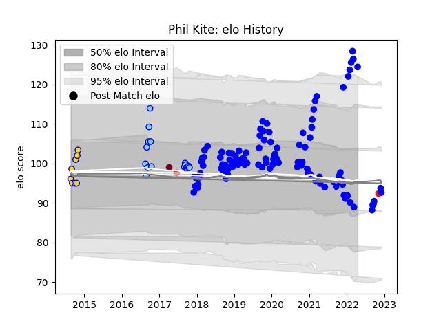

---  
layout: page  
title: Phil Kite  
date: 2022-12-09 13:22:10.275308  
categories: player  
---
# Phil Kite

## Positions: P

## Country: Tonga

## Current elo: 94.0

## Current Percentile: 45.0

# Elo History

# Match History

| Team            |   Appearances |   Win Rate |
|:----------------|--------------:|-----------:|
| Vannes          |            49 |   0.561224 |
| Northland       |            18 |   0.277778 |
| Brisbane City   |             5 |   1        |
| Tonga           |             2 |   0.5      |
| Queensland Reds |             1 |   0        |

| Opponent           |   Matches |   Win Rate |
|:-------------------|----------:|-----------:|
| Colomiers          |         5 |   0.6      |
| Rouen              |         5 |   0.4      |
| Mont-de-Marsan     |         5 |   0.6      |
| Biarritz Olympique |         4 |   0.5      |
| Wellington         |         3 |   0        |
| Nevers             |         3 |   0.666667 |
| Soyaux-Angouleme   |         3 |   0.666667 |
| Beziers            |         3 |   0.666667 |
| Grenoble           |         3 |   0.666667 |
| Provence Rugby     |         3 |   0.333333 |
| Waikato            |         2 |   1        |
| US Bressane        |         2 |   1        |
| Southland          |         2 |   0.5      |
| Perth Spirit       |         2 |   1        |
| Otago              |         2 |   0.5      |
| North Harbour      |         2 |   0        |
| Agen               |         2 |   0.5      |
| Carcassonne        |         2 |   0.75     |
| Montauban          |         2 |   0.25     |
| Aurillac           |         2 |   1        |
| Manawatu           |         2 |   0        |
| NSW Country Eagles |         1 |   1        |
| Wales              |         1 |   0        |
| Bay of Plenty      |         1 |   0        |
| Tasman             |         1 |   0        |
| Sydney Stars       |         1 |   1        |
| Spain              |         1 |   1        |
| Bayonne            |         1 |   0        |
| Counties Manukau   |         1 |   0        |
| Auckland           |         1 |   0        |
| Hawke's Bay        |         1 |   1        |
| Hurricanes         |         1 |   0        |
| Perpignan          |         1 |   0        |
| Oyonnax            |         1 |   0        |
| North Harbour Rays |         1 |   1        |
| Massy              |         1 |   1        |
| Narbonne           |         1 |   0.5      |