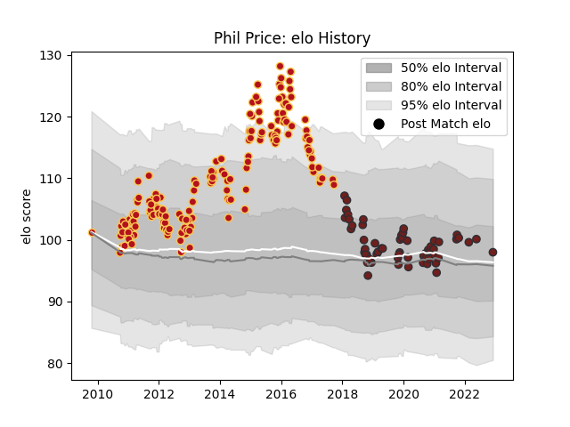

---  
layout: page  
title: Phil Price  
date: 2022-12-09 13:20:07.113440  
categories: player  
---
# Phil Price

## Positions: P

## Current elo: 98.0

## Current Percentile: None

# Elo History

# Match History

| Team     |   Appearances |   Win Rate |
|:---------|--------------:|-----------:|
| Dragons  |           161 |   0.39441  |
| Scarlets |            58 |   0.474138 |

| Opponent             |   Matches |   Win Rate |
|:---------------------|----------:|-----------:|
| Edinburgh            |        21 |  0.333333  |
| Benetton Treviso     |        17 |  0.647059  |
| Ospreys              |        17 |  0.411765  |
| Ulster               |        15 |  0.333333  |
| Cardiff Blues        |        15 |  0.4       |
| Leinster             |        14 |  0.25      |
| Munster              |        13 |  0.230769  |
| Glasgow Warriors     |        12 |  0.25      |
| Connacht             |        12 |  0.333333  |
| Scarlets             |        11 |  0.0909091 |
| Zebre                |         9 |  0.722222  |
| Dragons              |         5 |  0.6       |
| Wasps                |         4 |  0.5       |
| Sale Sharks          |         4 |  0.5       |
| Aironi               |         4 |  1         |
| Southern Kings       |         3 |  1         |
| Mogliano             |         3 |  1         |
| Gloucester Rugby     |         2 |  0.5       |
| Harlequins           |         2 |  0         |
| Worcester Warriors   |         2 |  0.5       |
| Brive                |         2 |  0.5       |
| Toulon               |         2 |  0         |
| Stade Toulousain     |         2 |  0         |
| Bucuresti            |         2 |  1         |
| Castres Olympique    |         2 |  0.5       |
| Perpignan            |         2 |  0.5       |
| Pau                  |         2 |  1         |
| Northampton Saints   |         2 |  0         |
| Newcastle Falcons    |         2 |  0.5       |
| Lions                |         2 |  0.5       |
| Exeter Chiefs        |         2 |  0         |
| Leicester Tigers     |         2 |  0         |
| Cavalieri Prato      |         1 |  1         |
| RC Enisei            |         1 |  0         |
| Cheetahs             |         1 |  1         |
| Montpellier Herault  |         1 |  0         |
| Bath Rugby           |         1 |  0         |
| Stade Francais Paris |         1 |  1         |
| London Irish         |         1 |  1         |
| Stormers             |         1 |  0         |
| Bayonne              |         1 |  1         |
| London Welsh         |         1 |  1         |