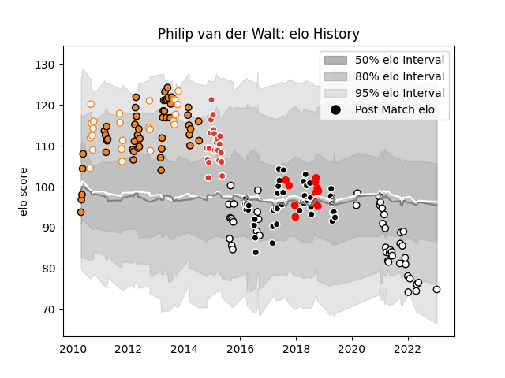

---  
layout: page  
title: Philip van der Walt  
date: 2023-01-17 11:42:14.081213  
categories: player  
---
# Philip van der Walt

## Positions: N8, FL

## Current elo: 75.0

## Current Percentile: 10.0

# Elo History

# Match History

| Team                  |   Appearances |   Win Rate |
|:----------------------|--------------:|-----------:|
| Cheetahs              |            49 |   0.438776 |
| Sharks                |            44 |   0.534091 |
| Newcastle Falcons     |            31 |   0.370968 |
| Free State Cheetahs   |            24 |   0.625    |
| Biarritz Olympique    |            22 |   0.590909 |
| Natal Sharks          |            16 |   0.53125  |
| Yokohama Canon Eagles |            11 |   0.318182 |

| Opponent                          |   Matches |   Win Rate |
|:----------------------------------|----------:|-----------:|
| Lions                             |        13 |   0.384615 |
| Bulls                             |         8 |   0.1875   |
| Stormers                          |         8 |   0.5      |
| Griquas                           |         7 |   1        |
| Blue Bulls                        |         7 |   0.5      |
| Jaguares                          |         6 |   0.666667 |
| Golden Lions                      |         6 |   0.416667 |
| Blues                             |         6 |   0.5      |
| Hurricanes                        |         5 |   0.2      |
| Crusaders                         |         5 |   0.1      |
| Chiefs                            |         5 |   0.3      |
| Pumas                             |         5 |   0.8      |
| New South Wales Waratahs          |         5 |   1        |
| Queensland Reds                   |         5 |   0.2      |
| Western Province                  |         5 |   0.2      |
| Sharks                            |         5 |   0.4      |
| Melbourne Rebels                  |         4 |   0.625    |
| Highlanders                       |         4 |   0.75     |
| Western Force                     |         4 |   1        |
| Gloucester Rugby                  |         4 |   0.25     |
| Southern Kings                    |         4 |   0.75     |
| London Irish                      |         4 |   0.25     |
| Harlequins                        |         3 |   0.333333 |
| Brumbies                          |         3 |   0.333333 |
| Natal Sharks                      |         3 |   0        |
| Leicester Tigers                  |         3 |   0        |
| Massy                             |         2 |   1        |
| Montauban                         |         2 |   0.5      |
| Narbonne                          |         2 |   1        |
| Sunwolves                         |         2 |   1        |
| Wasps                             |         2 |   0.5      |
| Northampton Saints                |         2 |   0.5      |
| Pau                               |         2 |   0        |
| Leopards                          |         2 |   1        |
| Agen                              |         2 |   0.5      |
| Worcester Warriors                |         2 |   0.75     |
| Eastern Province Kings            |         2 |   1        |
| Bristol Rugby                     |         2 |   0        |
| Black Rams Tokyo                  |         2 |   0        |
| Coca-Cola Red Sparks              |         2 |   1        |
| Colomiers                         |         2 |   0.5      |
| Bourgoin-Jallieu                  |         2 |   1        |
| Exeter Chiefs                     |         2 |   0.5      |
| Free State Cheetahs               |         2 |   0.25     |
| Bath Rugby                        |         2 |   0.5      |
| Bedford                           |         1 |   1        |
| Toshiba Brave Lupus Tokyo         |         1 |   1        |
| Sale Sharks                       |         1 |   0        |
| Tarbes                            |         1 |   0        |
| Beziers                           |         1 |   1        |
| Boland Cavaliers                  |         1 |   1        |
| Shizuoka Blue Revs                |         1 |   0        |
| Aurillac                          |         1 |   0        |
| Tokyo Sungoliath                  |         1 |   0        |
| Kubota Spears Funabashi Tokyo-Bay |         1 |   0        |
| Saitama Wild Knights              |         1 |   0        |
| Jersey                            |         1 |   1        |
| Perpignan                         |         1 |   1        |
| Cardiff Blues                     |         1 |   0        |
| Castres Olympique                 |         1 |   1        |
| Cheetahs                          |         1 |   1        |
| Dax                               |         1 |   0        |
| Mont-de-Marsan                    |         1 |   0        |
| Mie Honda Heat                    |         1 |   0.5      |
| Green Rockets Tokatsu             |         1 |   0        |
| Albi                              |         1 |   1        |
| Carcassonne                       |         1 |   1        |