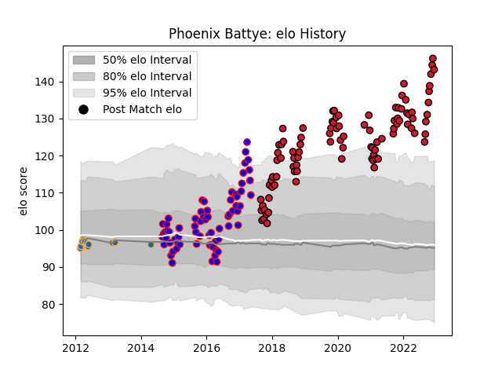

---  
layout: page  
title: Phoenix Battye  
date: 2023-01-13 11:28:13.616185  
categories: player  
---
# Phoenix Battye

## Positions: L

## Current elo: 96.0

## Current Percentile: 99.0

# Elo History

# Match History

| Team          |   Appearances |   Win Rate |
|:--------------|--------------:|-----------:|
| Oyonnax       |           103 |   0.582524 |
| Beziers       |            77 |   0.525974 |
| Western Force |            14 |   0.285714 |

| Opponent                   |   Matches |   Win Rate |
|:---------------------------|----------:|-----------:|
| Colomiers                  |        12 |   0.583333 |
| Carcassonne                |        10 |   0.7      |
| Aurillac                   |        10 |   0.4      |
| Provence Rugby             |         9 |   0.833333 |
| Biarritz Olympique         |         9 |   0.222222 |
| Montauban                  |         9 |   0.555556 |
| Agen                       |         8 |   0.75     |
| Perpignan                  |         8 |   0.25     |
| Mont-de-Marsan             |         8 |   0.4375   |
| Vannes                     |         8 |   0.75     |
| Dax                        |         6 |   0.5      |
| Beziers                    |         6 |   0.583333 |
| Narbonne                   |         6 |   0.5      |
| Albi                       |         6 |   0.75     |
| Grenoble                   |         6 |   0.666667 |
| Rouen                      |         5 |   0.6      |
| Nevers                     |         5 |   0.6      |
| Bourgoin-Jallieu           |         5 |   1        |
| Lyon                       |         4 |   0.25     |
| Bayonne                    |         4 |   0.75     |
| Soyaux-Angouleme           |         3 |   1        |
| Massy                      |         3 |   0.666667 |
| Melbourne Rebels           |         3 |   0        |
| US Bressane                |         3 |   1        |
| Queensland Reds            |         3 |   0.666667 |
| Brive                      |         3 |   0.333333 |
| Tarbes                     |         3 |   0.666667 |
| Pau                        |         2 |   0        |
| Castres Olympique          |         2 |   0        |
| Racing 92                  |         2 |   0        |
| New South Wales Waratahs   |         2 |   0.5      |
| Oyonnax                    |         2 |   0.5      |
| Stade Toulousain           |         2 |   0.25     |
| Toulon                     |         2 |   0.5      |
| Montpellier Herault        |         2 |   0        |
| Clermont Auvergne          |         2 |   0.75     |
| Stade Francais Paris       |         2 |   0.5      |
| Stormers                   |         1 |   0        |
| Valence Romans Drome Rugby |         1 |   1        |
| Cheetahs                   |         1 |   0        |
| Sharks                     |         1 |   0        |
| La Rochelle                |         1 |   0.5      |
| Chiefs                     |         1 |   0        |
| Bordeaux Begles            |         1 |   0        |
| Lions                      |         1 |   1        |
| Brumbies                   |         1 |   0        |