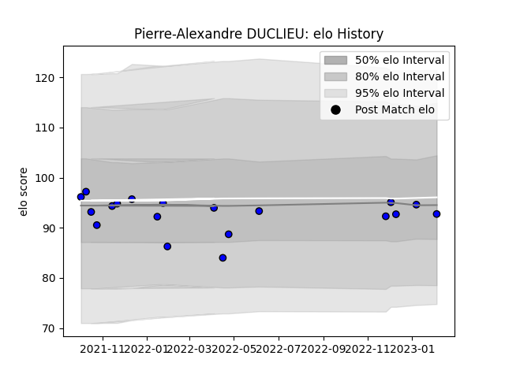

---  
layout: page  
title: Pierre-Alexandre DUCLIEU  
date: 2023-02-10 10:36:50.311549  
categories: player  
---
# Pierre-Alexandre DUCLIEU

## Positions: H

## Current elo: 93.0

## Current Percentile: 42.0

# Elo History

# Match History

| Team   |   Appearances |   Win Rate |
|:-------|--------------:|-----------:|
| Massy  |            19 |   0.789474 |

| Opponent                   |   Matches |   Win Rate |
|:---------------------------|----------:|-----------:|
| Soyaux-Angouleme           |         3 |   0.333333 |
| Bourgoin-Jallieu           |         2 |   1        |
| Dax                        |         2 |   1        |
| Suresnes                   |         2 |   1        |
| Agen                       |         1 |   0        |
| Albi                       |         1 |   1        |
| Aubenas                    |         1 |   1        |
| Carcassonne                |         1 |   1        |
| Chambery                   |         1 |   1        |
| Cognac Saint Jean d'Angély |         1 |   1        |
| Colomiers                  |         1 |   0        |
| Dijon                      |         1 |   1        |
| Tarbes                     |         1 |   1        |
| Vannes                     |         1 |   1        |