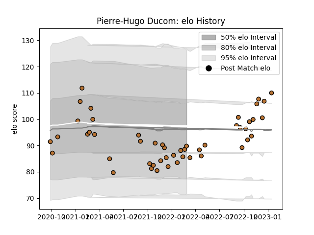

---  
layout: page  
title: Pierre-Hugo Ducom  
date: 2023-03-16 21:13:27.038284  
categories: player  
---
# Pierre-Hugo Ducom

## Positions: W, C

## Current elo: 88.0

## Current Percentile: 21.0

# Elo History

# Match History

| Team     |   Appearances |   Win Rate |
|:---------|--------------:|-----------:|
| Narbonne |            56 |   0.348214 |

| Opponent                   |   Matches |   Win Rate |
|:---------------------------|----------:|-----------:|
| US Bressane                |         5 |   0.2      |
| Dax                        |         3 |   0.333333 |
| Suresnes                   |         3 |   0.666667 |
| Bourgoin-Jallieu           |         3 |   0.666667 |
| Albi                       |         3 |   0        |
| Tarbes                     |         3 |   0.333333 |
| Grenoble                   |         2 |   0.25     |
| Oyonnax                    |         2 |   0        |
| Nice                       |         2 |   1        |
| Nevers                     |         2 |   0        |
| Mont-de-Marsan             |         2 |   0        |
| Dijon                      |         2 |   0.5      |
| Cognac Saint Jean d'Angély |         2 |   1        |
| Chambery                   |         2 |   0        |
| Carcassonne                |         2 |   0        |
| Blagnac                    |         2 |   0.75     |
| Bayonne                    |         2 |   0        |
| Valence Romans Drome Rugby |         2 |   0        |
| Aubenas                    |         2 |   0.5      |
| Rouen                      |         2 |   0.5      |
| Rennes                     |         1 |   1        |
| Agen                       |         1 |   1        |
| Provence Rugby             |         1 |   1        |
| Montauban                  |         1 |   0        |
| Colomiers                  |         1 |   0        |
| Beziers                    |         1 |   0        |
| Aurillac                   |         1 |   0        |
| Vannes                     |         1 |   0.5      |