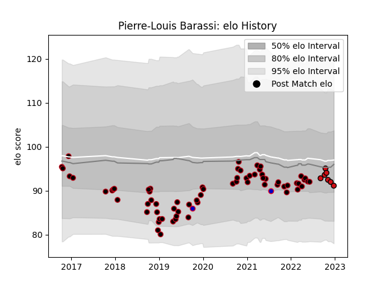

---  
layout: page  
title: Pierre-Louis Barassi  
date: 2023-01-06 00:12:06.151190  
categories: player  
---
# Pierre-Louis Barassi

## Positions: C

## Country: France

## Current elo: 106.0

## Current Percentile: 53.0

# Elo History

# Match History

| Team             |   Appearances |   Win Rate |
|:-----------------|--------------:|-----------:|
| Lyon             |            67 |   0.514925 |
| Stade Toulousain |             8 |   0.8125   |
| France           |             2 |   0.5      |

| Opponent             |   Matches |   Win Rate |
|:---------------------|----------:|-----------:|
| Montpellier Herault  |         6 |   0.833333 |
| La Rochelle          |         6 |   0.5      |
| Agen                 |         5 |   0.8      |
| Brive                |         5 |   0.8      |
| Stade Toulousain     |         5 |   0.6      |
| Clermont Auvergne    |         5 |   0.6      |
| Toulon               |         5 |   0.4      |
| Bordeaux Begles      |         5 |   0.6      |
| Castres Olympique    |         4 |   0.5      |
| Cardiff Blues        |         3 |   0        |
| Racing 92            |         3 |   0.666667 |
| Grenoble             |         3 |   1        |
| Bayonne              |         3 |   1        |
| Glasgow Warriors     |         2 |   0        |
| Stade Francais Paris |         2 |   0.25     |
| Newcastle Falcons    |         2 |   0.5      |
| Ospreys              |         2 |   0        |
| Pau                  |         2 |   0.25     |
| Saracens             |         2 |   0        |
| Tonga                |         1 |   1        |
| Northampton Saints   |         1 |   0        |
| Perpignan            |         1 |   1        |
| Benetton Treviso     |         1 |   0        |
| Australia            |         1 |   0        |
| Biarritz Olympique   |         1 |   1        |
| Lyon                 |         1 |   0        |