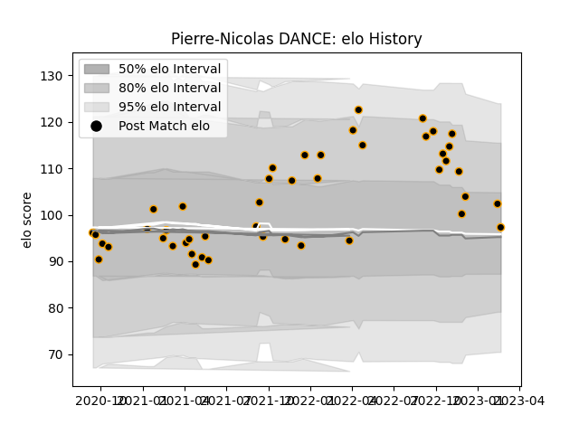

---  
layout: page  
title: Pierre-Nicolas DANCE  
date: 2023-02-28 11:08:03.433991  
categories: player  
---
# Pierre-Nicolas DANCE

## Positions: FL

## Current elo: 92.0

## Current Percentile: 54.0

# Elo History

# Match History

| Team     |   Appearances |   Win Rate |
|:---------|--------------:|-----------:|
| Chambery |            46 |   0.445652 |

| Opponent                   |   Matches |   Win Rate |
|:---------------------------|----------:|-----------:|
| Aubenas                    |         4 |   0.5      |
| Blagnac                    |         4 |   0.25     |
| Bourgoin-Jallieu           |         4 |   0.25     |
| Dijon                      |         4 |   0.5      |
| Nice                       |         4 |   0.5      |
| Suresnes                   |         4 |   0.75     |
| Dax                        |         3 |   0.333333 |
| Massy                      |         3 |   0.5      |
| Tarbes                     |         3 |   0.666667 |
| US Bressane                |         3 |   0        |
| Albi                       |         2 |   0        |
| Cognac Saint Jean d'Angély |         2 |   1        |
| Narbonne                   |         2 |   1        |
| Rennes                     |         2 |   0.5      |
| Carqueiranne-Hyères        |         1 |   0        |
| Valence Romans Drome Rugby |         1 |   0        |