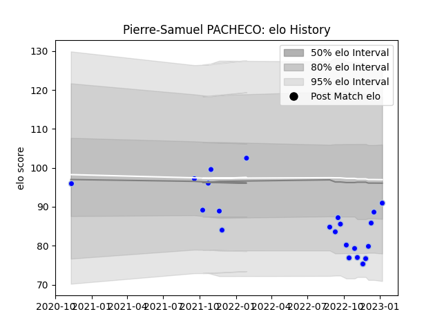

---  
layout: page  
title: Pierre-Samuel PACHECO  
date: 2023-03-30 11:32:57.284843  
categories: player  
---
# Pierre-Samuel PACHECO

Last updated: 2023-03-30
## Positions: FL

## Current elo: 90.0

## Current Percentile: 37.0

# Elo History

# Match History

| Team      |   Appearances |   Win Rate |
|:----------|--------------:|-----------:|
| Colomiers |            25 |        0.6 |

| Opponent           |   Matches |   Win Rate |
|:-------------------|----------:|-----------:|
| Carcassonne        |         3 |   0.666667 |
| Aurillac           |         2 |   0.5      |
| Beziers            |         2 |   0.5      |
| Grenoble           |         2 |   1        |
| Nevers             |         2 |   0.5      |
| Oyonnax            |         2 |   0.5      |
| Provence Rugby     |         2 |   0.5      |
| Vannes             |         2 |   0        |
| Agen               |         1 |   1        |
| Biarritz Olympique |         1 |   1        |
| Massy              |         1 |   1        |
| Mont-de-Marsan     |         1 |   0        |
| Montauban          |         1 |   0        |
| Narbonne           |         1 |   1        |
| Rouen              |         1 |   1        |
| Soyaux-Angouleme   |         1 |   1        |