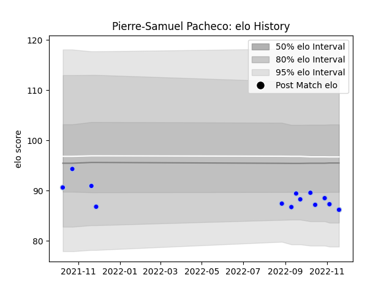

---  
layout: page  
title: Pierre-Samuel Pacheco  
date: 2022-11-22 11:34:39.469105  
categories: player  
---
# Pierre-Samuel Pacheco

## Positions: FL

## Current elo: 86.0

## Current Percentile: 17.0

# Elo History

# Match History

| Team      |   Appearances |   Win Rate |
|:----------|--------------:|-----------:|
| Colomiers |            13 |   0.538462 |

| Opponent         |   Matches |   Win Rate |
|:-----------------|----------:|-----------:|
| Beziers          |         2 |        0.5 |
| Nevers           |         2 |        0.5 |
| Vannes           |         2 |        0   |
| Agen             |         1 |        1   |
| Carcassonne      |         1 |        1   |
| Mont-de-Marsan   |         1 |        0   |
| Montauban        |         1 |        0   |
| Narbonne         |         1 |        1   |
| Provence Rugby   |         1 |        1   |
| Soyaux-Angouleme |         1 |        1   |