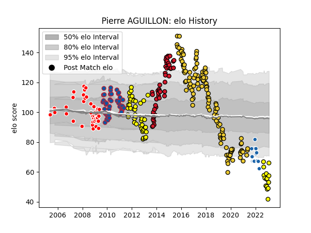

---  
layout: page  
title: Pierre AGUILLON  
date: 2023-02-05 17:58:33.395158  
categories: player  
---
# Pierre AGUILLON

## Positions: C

## Current elo: 66.0

## Current Percentile: 0.0

# Elo History

# Match History

| Team              |   Appearances |   Win Rate |
|:------------------|--------------:|-----------:|
| La Rochelle       |           126 |   0.615079 |
| Carcassonne       |            61 |   0.57377  |
| Oyonnax           |            47 |   0.489362 |
| Grenoble          |            45 |   0.688889 |
| Auch              |            41 |   0.390244 |
| Castres Olympique |            13 |   0.153846 |

| Opponent               |   Matches |   Win Rate |
|:-----------------------|----------:|-----------:|
| Stade Francais Paris   |        16 |   0.375    |
| Racing 92              |        16 |   0.53125  |
| Bordeaux Begles        |        15 |   0.566667 |
| Pau                    |        15 |   0.633333 |
| Agen                   |        14 |   0.607143 |
| Lyon                   |        14 |   0.428571 |
| Oyonnax                |        13 |   0.615385 |
| Grenoble               |        13 |   0.576923 |
| Toulon                 |        13 |   0.538462 |
| Stade Toulousain       |        12 |   0.375    |
| Brive                  |        12 |   0.75     |
| Castres Olympique      |        12 |   0.583333 |
| Clermont Auvergne      |        12 |   0.375    |
| Montpellier Herault    |        11 |   0.545455 |
| Colomiers              |        10 |   0.5      |
| Aurillac               |         9 |   0.555556 |
| Tarbes                 |         9 |   0.555556 |
| Albi                   |         8 |   0.5625   |
| Bayonne                |         8 |   0.5      |
| La Rochelle            |         8 |   0.4375   |
| Narbonne               |         8 |   0.625    |
| Dax                    |         6 |   0.75     |
| Beziers                |         6 |   1        |
| Provence Rugby         |         6 |   0.666667 |
| Mont-de-Marsan         |         6 |   0.333333 |
| Auch                   |         5 |   1        |
| Massy                  |         4 |   0        |
| Biarritz Olympique     |         4 |   0.5      |
| Harlequins             |         4 |   0.5      |
| Gloucester Rugby       |         4 |   0.25     |
| Périgueux              |         2 |   1        |
| RC Enisei              |         2 |   1        |
| Rouen                  |         2 |   1        |
| Saint-Etienne          |         2 |   1        |
| Ulster                 |         2 |   0.5      |
| Worcester Warriors     |         2 |   0.75     |
| Perpignan              |         2 |   1        |
| Montauban              |         2 |   0.5      |
| Zebre                  |         2 |   0.5      |
| Bourgoin-Jallieu       |         2 |   0        |
| Lannemezan             |         2 |   1        |
| Glasgow Warriors       |         2 |   0.5      |
| Munster                |         2 |   0        |
| Edinburgh              |         1 |   1        |
| Wasps                  |         1 |   1        |
| Bristol Rugby          |         1 |   0        |
| US Bressane            |         1 |   0        |
| Tyrosse                |         1 |   1        |
| Carcassonne            |         1 |   1        |
| Nevers                 |         1 |   1        |
| Enisey-STM Krasnoyarsk |         1 |   1        |
| Scarlets               |         1 |   0        |
| Sale Sharks            |         1 |   0        |
| Gaillac                |         1 |   1        |
| Limoges                |         1 |   1        |
| London Irish           |         1 |   0        |
| Exeter Chiefs          |         1 |   0        |