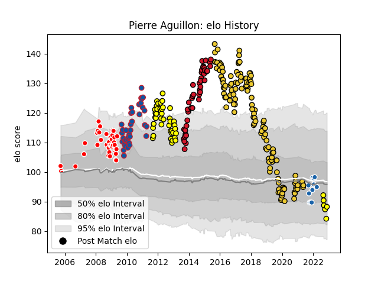

---  
layout: page  
title: Pierre Aguillon  
date: 2022-12-14 11:34:57.698841  
categories: player  
---
# Pierre Aguillon

## Positions: C

## Current elo: 84.0

## Current Percentile: 10.0

# Elo History

# Match History

| Team              |   Appearances |   Win Rate |
|:------------------|--------------:|-----------:|
| La Rochelle       |           125 |   0.612    |
| Carcassonne       |            50 |   0.63     |
| Oyonnax           |            43 |   0.488372 |
| Auch              |            37 |   0.378378 |
| Grenoble          |            37 |   0.689189 |
| Castres Olympique |            12 |   0.166667 |

| Opponent             |   Matches |   Win Rate |
|:---------------------|----------:|-----------:|
| Racing 92            |        16 |   0.53125  |
| Stade Francais Paris |        16 |   0.375    |
| Agen                 |        14 |   0.607143 |
| Pau                  |        14 |   0.678571 |
| Lyon                 |        13 |   0.384615 |
| Oyonnax              |        13 |   0.615385 |
| Bordeaux Begles      |        13 |   0.615385 |
| Toulon               |        12 |   0.583333 |
| Stade Toulousain     |        12 |   0.375    |
| Brive                |        12 |   0.75     |
| Clermont Auvergne    |        11 |   0.318182 |
| Grenoble             |        11 |   0.545455 |
| Montpellier Herault  |        11 |   0.545455 |
| Castres Olympique    |        11 |   0.636364 |
| Tarbes               |         9 |   0.555556 |
| Aurillac             |         9 |   0.555556 |
| Colomiers            |         8 |   0.625    |
| Albi                 |         7 |   0.571429 |
| Bayonne              |         7 |   0.571429 |
| Narbonne             |         7 |   0.571429 |
| Dax                  |         6 |   0.75     |
| Provence Rugby       |         6 |   0.666667 |
| Beziers              |         6 |   1        |
| La Rochelle          |         6 |   0.333333 |
| Gloucester Rugby     |         4 |   0.25     |
| Harlequins           |         4 |   0.5      |
| Auch                 |         4 |   1        |
| Mont-de-Marsan       |         3 |   0.333333 |
| Montauban            |         2 |   0.5      |
| Périgueux            |         2 |   1        |
| Worcester Warriors   |         2 |   0.75     |
| Ulster               |         2 |   0.5      |
| Biarritz Olympique   |         2 |   0.5      |
| Bourgoin-Jallieu     |         2 |   0        |
| Massy                |         2 |   0        |
| RC Enisei            |         2 |   1        |
| Saint-Etienne        |         2 |   1        |
| Zebre                |         2 |   0.5      |
| Munster              |         2 |   0        |
| Glasgow Warriors     |         2 |   0.5      |
| Perpignan            |         2 |   1        |
| Nevers               |         1 |   1        |
| Wasps                |         1 |   1        |
| Limoges              |         1 |   1        |
| US Bressane          |         1 |   0        |
| Tyrosse              |         1 |   1        |
| Gaillac              |         1 |   1        |
| Lannemezan           |         1 |   1        |
| Edinburgh            |         1 |   1        |
| Scarlets             |         1 |   0        |
| Sale Sharks          |         1 |   0        |
| Rouen                |         1 |   1        |
| Exeter Chiefs        |         1 |   0        |
| Bristol Rugby        |         1 |   0        |