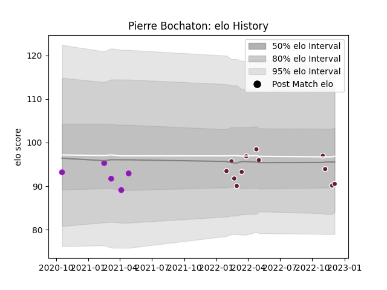

---  
layout: page  
title: Pierre Bochaton  
date: 2022-11-15 23:42:07.693041  
categories: player  
---
# Pierre Bochaton

## Positions: FL, L

## Current elo: 93.0

## Current Percentile: 54.0

# Elo History

# Match History

| Team            |   Appearances |   Win Rate |
|:----------------|--------------:|-----------:|
| Bordeaux Begles |            10 |        0.4 |
| US Bressane     |             5 |        0.8 |

| Opponent                   |   Matches |   Win Rate |
|:---------------------------|----------:|-----------:|
| Toulon                     |         3 |   0.333333 |
| Aubenas                    |         1 |   1        |
| Castres Olympique          |         1 |   1        |
| Chambery                   |         1 |   1        |
| Clermont Auvergne          |         1 |   0        |
| Cognac Saint Jean d'Angély |         1 |   1        |
| Massy                      |         1 |   0        |
| Montpellier Herault        |         1 |   1        |
| Pau                        |         1 |   0        |
| Racing 92                  |         1 |   0        |
| Stade Francais Paris       |         1 |   1        |
| Stade Toulousain           |         1 |   0        |
| Tarbes                     |         1 |   1        |