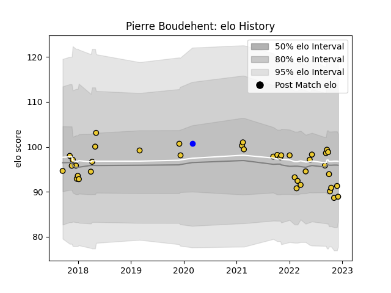

---  
layout: page  
title: Pierre Boudehent  
date: 2022-12-14 11:30:21.390299  
categories: player  
---
# Pierre Boudehent

## Positions: W, C

## Current elo: 91.0

## Current Percentile: 21.0

# Elo History

# Match History

| Team        |   Appearances |   Win Rate |
|:------------|--------------:|-----------:|
| La Rochelle |            41 |   0.573171 |
| Vannes      |             1 |   1        |

| Opponent             |   Matches |   Win Rate |
|:---------------------|----------:|-----------:|
| Castres Olympique    |         5 |   0.6      |
| Racing 92            |         4 |   0.25     |
| Stade Francais Paris |         4 |   0.75     |
| Toulon               |         3 |   0.666667 |
| Lyon                 |         3 |   1        |
| Perpignan            |         3 |   0.666667 |
| Agen                 |         2 |   1        |
| Bordeaux Begles      |         2 |   0.5      |
| Clermont Auvergne    |         2 |   0.5      |
| Montpellier Herault  |         2 |   0.5      |
| Pau                  |         2 |   1        |
| Stade Toulousain     |         1 |   0        |
| Scarlets             |         1 |   0        |
| Roval Drome XV       |         1 |   1        |
| Northampton Saints   |         1 |   1        |
| Oyonnax              |         1 |   0.5      |
| Bayonne              |         1 |   0        |
| Glasgow Warriors     |         1 |   0        |
| Brive                |         1 |   1        |
| Biarritz Olympique   |         1 |   0        |
| Wasps                |         1 |   0        |