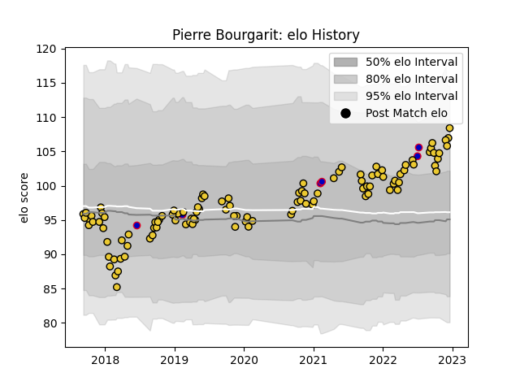

---  
layout: page  
title: Pierre Bourgarit  
date: 2023-01-13 11:37:38.665410  
categories: player  
---
# Pierre Bourgarit

## Positions: H

## Country: France

## Current elo: 92.0

## Current Percentile: 66.0

# Elo History

# Match History

| Team        |   Appearances |   Win Rate |
|:------------|--------------:|-----------:|
| La Rochelle |           114 |   0.614035 |
| France      |             6 |   0.666667 |

| Opponent             |   Matches |   Win Rate |
|:---------------------|----------:|-----------:|
| Stade Toulousain     |        12 |   0.25     |
| Clermont Auvergne    |        10 |   0.3      |
| Racing 92            |         9 |   0.666667 |
| Bordeaux Begles      |         8 |   0.625    |
| Toulon               |         7 |   0.714286 |
| Castres Olympique    |         7 |   0.571429 |
| Pau                  |         7 |   0.857143 |
| Montpellier Herault  |         6 |   0.666667 |
| Lyon                 |         6 |   0.833333 |
| Stade Francais Paris |         5 |   0.2      |
| Perpignan            |         4 |   1        |
| Bayonne              |         4 |   0.5      |
| Agen                 |         4 |   1        |
| Brive                |         4 |   1        |
| Ulster               |         3 |   0.666667 |
| Sale Sharks          |         3 |   0.666667 |
| Wasps                |         2 |   0.5      |
| Harlequins           |         2 |   1        |
| Grenoble             |         2 |   1        |
| Exeter Chiefs        |         2 |   0        |
| Japan                |         2 |   1        |
| Italy                |         1 |   1        |
| Scarlets             |         1 |   0        |
| Biarritz Olympique   |         1 |   0        |
| Bristol Rugby        |         1 |   1        |
| RC Enisei            |         1 |   1        |
| England              |         1 |   0        |
| Oyonnax              |         1 |   1        |
| Northampton Saints   |         1 |   1        |
| New Zealand          |         1 |   0        |
| Ireland              |         1 |   1        |
| Zebre                |         1 |   1        |