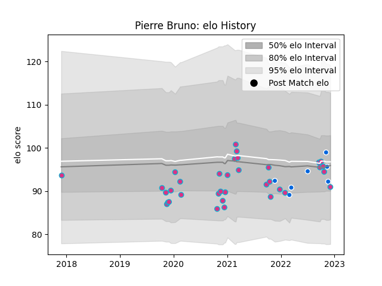

---  
layout: page  
title: Pierre Bruno  
date: 2022-11-15 23:36:39.069070  
categories: player  
---
# Pierre Bruno

## Positions: W

## Country: Italy

## Current elo: 94.0

## Current Percentile: 57.0

# Elo History

# Match History

| Team   |   Appearances |   Win Rate |
|:-------|--------------:|-----------:|
| Zebre  |            34 |   0.191176 |
| Italy  |             6 |   0.666667 |

| Opponent             |   Matches |   Win Rate |
|:---------------------|----------:|-----------:|
| Munster              |         5 |        0   |
| Glasgow Warriors     |         4 |        0   |
| Leinster             |         4 |        0   |
| Scarlets             |         3 |        0   |
| Benetton Treviso     |         2 |        0.5 |
| Ulster               |         2 |        0   |
| Brive                |         2 |        0.5 |
| Dragons              |         2 |        1   |
| Edinburgh            |         2 |        0   |
| Stade Francais Paris |         2 |        0.5 |
| Ospreys              |         2 |        0.5 |
| Australia            |         1 |        1   |
| Sharks               |         1 |        0   |
| Scotland             |         1 |        0   |
| Lions                |         1 |        0   |
| Samoa                |         1 |        1   |
| Romania              |         1 |        1   |
| Bayonne              |         1 |        0.5 |
| Ireland              |         1 |        0   |
| Bristol Rugby        |         1 |        0   |
| Uruguay              |         1 |        1   |