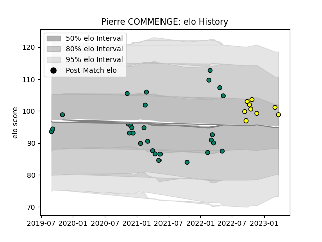

---  
layout: page  
title: Pierre COMMENGE  
date: 2023-03-11 00:12:42.045629  
categories: player  
---
# Pierre COMMENGE

## Positions: P

## Current elo: 101.0

## Current Percentile: 65.0

# Elo History

# Match History

| Team      |   Appearances |   Win Rate |
|:----------|--------------:|-----------:|
| Montauban |            28 |   0.410714 |
| Albi      |             8 |   0.5625   |

| Opponent            |   Matches |   Win Rate |
|:--------------------|----------:|-----------:|
| Mont-de-Marsan      |         3 |   0.666667 |
| Rouen               |         3 |   0.666667 |
| Provence Rugby      |         3 |   0.333333 |
| Oyonnax             |         3 |   0.333333 |
| Beziers             |         3 |   0        |
| Aurillac            |         2 |   0.5      |
| Suresnes            |         2 |   0.5      |
| Narbonne            |         2 |   1        |
| Nevers              |         2 |   0.5      |
| Vannes              |         2 |   0        |
| Grenoble            |         1 |   1        |
| Colomiers           |         1 |   0        |
| Nice                |         1 |   0.5      |
| Carqueiranne-Hyères |         1 |   0        |
| Carcassonne         |         1 |   0        |
| Rennes              |         1 |   1        |
| Bourgoin-Jallieu    |         1 |   1        |
| Roval Drome XV      |         1 |   1        |
| Soyaux-Angouleme    |         1 |   0.5      |
| Biarritz Olympique  |         1 |   0        |
| Tarbes              |         1 |   0        |