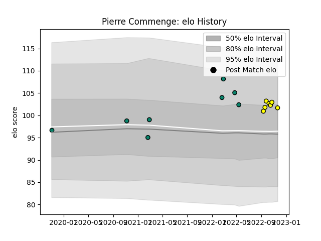

---  
layout: page  
title: Pierre Commenge  
date: 2022-11-22 11:32:42.234349  
categories: player  
---
# Pierre Commenge

## Positions: P

## Current elo: 102.0

## Current Percentile: 76.0

# Elo History

# Match History

| Team      |   Appearances |   Win Rate |
|:----------|--------------:|-----------:|
| Montauban |             8 |        0.5 |
| Albi      |             7 |        0.5 |

| Opponent            |   Matches |   Win Rate |
|:--------------------|----------:|-----------:|
| Aurillac            |         2 |        0.5 |
| Nevers              |         2 |        0.5 |
| Oyonnax             |         2 |        0.5 |
| Bourgoin-Jallieu    |         1 |        1   |
| Carqueiranne-Hyères |         1 |        0   |
| Narbonne            |         1 |        1   |
| Nice                |         1 |        0.5 |
| Rennes              |         1 |        1   |
| Rouen               |         1 |        1   |
| Suresnes            |         1 |        0   |
| Tarbes              |         1 |        0   |
| Vannes              |         1 |        0   |