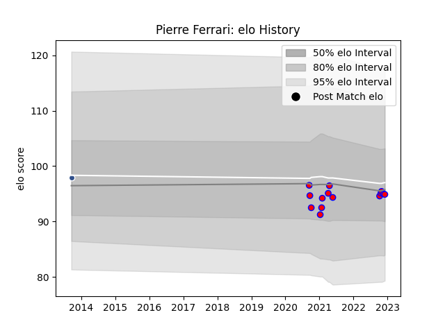

---  
layout: page  
title: Pierre Ferrari  
date: 2022-12-09 13:09:10.916490  
categories: player  
---
# Pierre Ferrari

## Positions: SH

## Current elo: 95.0

## Current Percentile: None

# Elo History

# Match History

| Team    |   Appearances |   Win Rate |
|:--------|--------------:|-----------:|
| Blagnac |            14 |   0.535714 |
| Agen    |             1 |   0        |

| Opponent                   |   Matches |   Win Rate |
|:---------------------------|----------:|-----------:|
| Dax                        |         3 |   0.333333 |
| Bourgoin-Jallieu           |         2 |   0.5      |
| Chambery                   |         2 |   1        |
| Beziers                    |         1 |   0        |
| Cognac Saint Jean d'Angély |         1 |   1        |
| Massy                      |         1 |   1        |
| Narbonne                   |         1 |   0.5      |
| Rennes                     |         1 |   1        |
| Suresnes                   |         1 |   0        |
| Tarbes                     |         1 |   0        |
| US Bressane                |         1 |   0        |