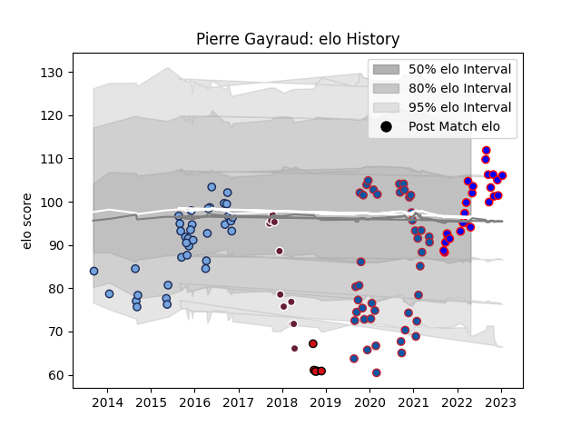

---  
layout: page  
title: Pierre Gayraud  
date: 2023-03-21 17:58:40.809314  
categories: player  
---
# Pierre Gayraud

Last updated: 2023-03-21
## Positions: L, FL

## Current elo: 99.0

## Current Percentile: 89.0

# Elo History

# Match History

| Team             |   Appearances |   Win Rate |
|:-----------------|--------------:|-----------:|
| Grenoble         |            43 |   0.55814  |
| Bayonne          |            38 |   0.5      |
| Beziers          |            24 |   0.416667 |
| Bordeaux Begles  |            12 |   0.583333 |
| Stade Toulousain |             6 |   0.833333 |

| Opponent                   |   Matches |   Win Rate |
|:---------------------------|----------:|-----------:|
| Montauban                  |         9 |   0.5      |
| Colomiers                  |         7 |   0.357143 |
| Nevers                     |         6 |   0.666667 |
| Aurillac                   |         5 |   0.6      |
| Soyaux-Angouleme           |         5 |   0.6      |
| Provence Rugby             |         5 |   0.4      |
| Biarritz Olympique         |         5 |   0.3      |
| Oyonnax                    |         5 |   0.6      |
| Mont-de-Marsan             |         5 |   0.6      |
| Agen                       |         4 |   1        |
| Rouen                      |         4 |   0.5      |
| Perpignan                  |         4 |   0.5      |
| Grenoble                   |         4 |   0.25     |
| Vannes                     |         4 |   0.5      |
| Carcassonne                |         4 |   0.5      |
| Beziers                    |         4 |   0.75     |
| Lyon                       |         3 |   0.166667 |
| Racing 92                  |         3 |   0.333333 |
| Pau                        |         3 |   0.666667 |
| Narbonne                   |         3 |   1        |
| La Rochelle                |         3 |   0.333333 |
| Clermont Auvergne          |         3 |   0.333333 |
| Albi                       |         2 |   1        |
| Montpellier Herault        |         2 |   0        |
| Brive                      |         2 |   0.5      |
| Bordeaux Begles            |         2 |   0        |
| RC Enisei                  |         2 |   1        |
| Bayonne                    |         2 |   0.5      |
| Tarbes                     |         1 |   1        |
| US Bressane                |         1 |   0        |
| Roval Drome XV             |         1 |   1        |
| Stade Francais Paris       |         1 |   0        |
| Bath Rugby                 |         1 |   1        |
| Valence Romans Drome Rugby |         1 |   1        |
| Dax                        |         1 |   0        |
| Dragons                    |         1 |   1        |
| Newcastle Falcons          |         1 |   0        |
| Castres Olympique          |         1 |   0        |
| Leinster                   |         1 |   1        |
| Enisey-STM Krasnoyarsk     |         1 |   1        |
| Bourgoin-Jallieu           |         1 |   1        |