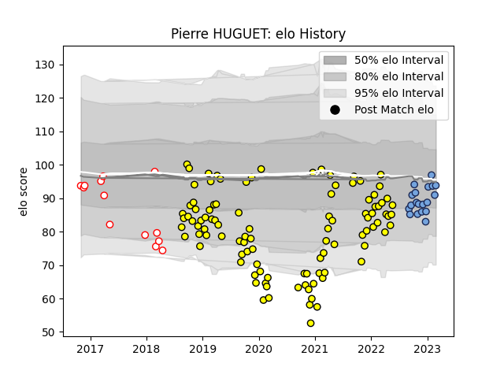

---  
layout: page  
title: Pierre HUGUET  
date: 2023-02-06 11:16:19.872960  
categories: player  
---
# Pierre HUGUET

## Positions: FL

## Current elo: 90.0

## Current Percentile: 48.0

# Elo History

# Match History

| Team        |   Appearances |   Win Rate |
|:------------|--------------:|-----------:|
| Carcassonne |           103 |   0.529126 |
| Bayonne     |            17 |   0.558824 |
| Dax         |            13 |   0.153846 |

| Opponent                   |   Matches |   Win Rate |
|:---------------------------|----------:|-----------:|
| Colomiers                  |         9 |   0.444444 |
| Nevers                     |         9 |   0.444444 |
| Aurillac                   |         9 |   0.444444 |
| Montauban                  |         8 |   0.625    |
| Mont-de-Marsan             |         8 |   0.375    |
| Vannes                     |         8 |   0.625    |
| Beziers                    |         8 |   0.5      |
| Oyonnax                    |         7 |   0.142857 |
| Provence Rugby             |         6 |   0.5      |
| Grenoble                   |         6 |   0.333333 |
| Soyaux-Angouleme           |         5 |   0.7      |
| Perpignan                  |         5 |   0.6      |
| Biarritz Olympique         |         5 |   0.6      |
| Bayonne                    |         4 |   0.5      |
| Agen                       |         4 |   0.25     |
| Rouen                      |         3 |   0.666667 |
| US Bressane                |         3 |   1        |
| Narbonne                   |         3 |   0.666667 |
| Brive                      |         3 |   0.666667 |
| Massy                      |         2 |   0.5      |
| Toulon                     |         2 |   0.5      |
| Stade Toulousain           |         2 |   0.5      |
| Bordeaux Begles            |         2 |   0.5      |
| Clermont Auvergne          |         1 |   1        |
| Castres Olympique          |         1 |   0        |
| Lyon                       |         1 |   1        |
| Pau                        |         1 |   0.5      |
| Roval Drome XV             |         1 |   1        |
| Carcassonne                |         1 |   0        |
| Stade Francais Paris       |         1 |   0        |
| La Rochelle                |         1 |   1        |
| Montpellier Herault        |         1 |   0        |
| Benetton Treviso           |         1 |   0        |
| Valence Romans Drome Rugby |         1 |   0        |
| Racing 92                  |         1 |   1        |