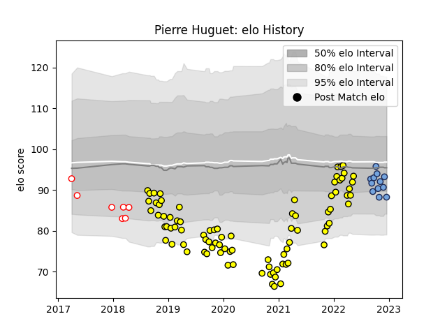

---  
layout: page  
title: Pierre Huguet  
date: 2022-12-18 16:14:45.723760  
categories: player  
---
# Pierre Huguet

## Positions: FL

## Current elo: 88.0

## Current Percentile: 41.0

# Elo History

# Match History

| Team        |   Appearances |   Win Rate |
|:------------|--------------:|-----------:|
| Carcassonne |            86 |   0.55814  |
| Bayonne     |            12 |   0.583333 |
| Dax         |             7 |   0.142857 |

| Opponent             |   Matches |   Win Rate |
|:---------------------|----------:|-----------:|
| Colomiers            |         8 |   0.5      |
| Nevers               |         8 |   0.5      |
| Aurillac             |         8 |   0.5      |
| Mont-de-Marsan       |         7 |   0.428571 |
| Montauban            |         7 |   0.714286 |
| Vannes               |         7 |   0.642857 |
| Beziers              |         7 |   0.571429 |
| Grenoble             |         6 |   0.333333 |
| Biarritz Olympique   |         5 |   0.6      |
| Soyaux-Angouleme     |         4 |   0.625    |
| Oyonnax              |         4 |   0        |
| Rouen                |         3 |   0.666667 |
| Provence Rugby       |         3 |   0.333333 |
| Perpignan            |         3 |   0.666667 |
| Bayonne              |         3 |   0.666667 |
| Narbonne             |         2 |   1        |
| Brive                |         2 |   0.5      |
| Agen                 |         2 |   0.5      |
| Massy                |         2 |   0.5      |
| Montpellier Herault  |         1 |   0        |
| Benetton Treviso     |         1 |   0        |
| Lyon                 |         1 |   1        |
| La Rochelle          |         1 |   1        |
| Clermont Auvergne    |         1 |   1        |
| Racing 92            |         1 |   1        |
| Castres Olympique    |         1 |   0        |
| Roval Drome XV       |         1 |   1        |
| Carcassonne          |         1 |   0        |
| Stade Francais Paris |         1 |   0        |
| Stade Toulousain     |         1 |   1        |
| Toulon               |         1 |   0        |
| US Bressane          |         1 |   1        |
| Bordeaux Begles      |         1 |   1        |