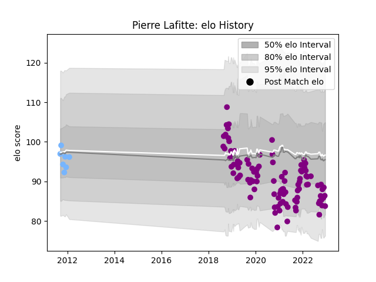

---  
layout: page  
title: Pierre Lafitte  
date: 2023-03-21 18:38:30.149582  
categories: player  
---
# Pierre Lafitte

Last updated: 2023-03-21
## Positions: FB, W

## Current elo: 87.0

## Current Percentile: 22.0

# Elo History

# Match History

| Team             |   Appearances |   Win Rate |
|:-----------------|--------------:|-----------:|
| Soyaux-Angouleme |           118 |   0.474576 |
| Périgueux        |             9 |   0.222222 |

| Opponent                   |   Matches |   Win Rate |
|:---------------------------|----------:|-----------:|
| Beziers                    |         8 |   0.5      |
| Carcassonne                |         7 |   0.428571 |
| Aurillac                   |         7 |   0.428571 |
| Massy                      |         7 |   0.642857 |
| Colomiers                  |         7 |   0.428571 |
| Vannes                     |         6 |   0.5      |
| Montauban                  |         6 |   0.333333 |
| Mont-de-Marsan             |         6 |   0.333333 |
| Grenoble                   |         6 |   0.333333 |
| Rouen                      |         6 |   0.333333 |
| Valence Romans Drome Rugby |         6 |   0.75     |
| Oyonnax                    |         5 |   0        |
| Nevers                     |         4 |   0.25     |
| Provence Rugby             |         4 |   0.75     |
| Perpignan                  |         4 |   0        |
| Biarritz Olympique         |         4 |   0.25     |
| Bourgoin-Jallieu           |         3 |   0.666667 |
| Dax                        |         3 |   0.666667 |
| Suresnes                   |         2 |   1        |
| Tarbes                     |         2 |   0.5      |
| US Bressane                |         2 |   0.5      |
| Nice                       |         2 |   0.5      |
| Agen                       |         2 |   0.5      |
| Albi                       |         2 |   0.5      |
| Dijon                      |         2 |   0.5      |
| Cognac Saint Jean d'Angély |         2 |   1        |
| Chambery                   |         2 |   0        |
| Brive                      |         2 |   0        |
| Blagnac                    |         2 |   1        |
| Bayonne                    |         2 |   0.5      |
| Narbonne                   |         1 |   1        |
| Roval Drome XV             |         1 |   1        |
| Aubenas                    |         1 |   1        |
| La Rochelle                |         1 |   0        |