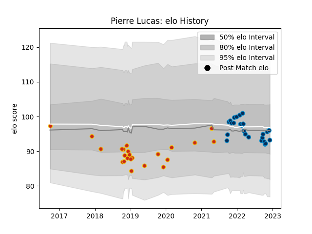

---  
layout: page  
title: Pierre Lucas  
date: 2022-12-09 13:04:12.688683  
categories: player  
---
# Pierre Lucas

## Positions: C, W

## Current elo: 93.0

## Current Percentile: 48.0

# Elo History

# Match History

| Team                |   Appearances |   Win Rate |
|:--------------------|--------------:|-----------:|
| Montpellier Herault |            25 |   0.62     |
| Perpignan           |            23 |   0.282609 |

| Opponent             |   Matches |   Win Rate |
|:---------------------|----------:|-----------:|
| Bordeaux Begles      |         5 |   0.3      |
| Biarritz Olympique   |         4 |   0.75     |
| Castres Olympique    |         4 |   0.25     |
| Pau                  |         4 |   0.5      |
| Toulon               |         3 |   0.666667 |
| Stade Toulousain     |         3 |   0        |
| Stade Francais Paris |         3 |   0.666667 |
| Racing 92            |         3 |   0.333333 |
| Aurillac             |         2 |   1        |
| Brive                |         2 |   0.75     |
| Sale Sharks          |         2 |   0        |
| Lyon                 |         2 |   0        |
| Rouen                |         2 |   0.5      |
| Perpignan            |         1 |   1        |
| Montauban            |         1 |   1        |
| Nevers               |         1 |   0        |
| Bayonne              |         1 |   1        |
| La Rochelle          |         1 |   1        |
| Connacht             |         1 |   0        |
| Clermont Auvergne    |         1 |   0        |
| Beziers              |         1 |   1        |
| Vannes               |         1 |   0        |