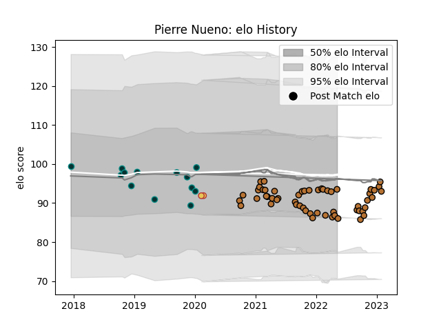

---  
layout: page  
title: Pierre Nueno  
date: 2022-12-14 11:31:53.908677  
categories: player  
---
# Pierre Nueno

## Positions: C

## Country: Spain

## Current elo: 87.0

## Current Percentile: 16.0

# Elo History

# Match History

| Team     |   Appearances |   Win Rate |
|:---------|--------------:|-----------:|
| Narbonne |            38 |   0.421053 |
| Pau      |            13 |   0.461538 |
| Spain    |             1 |   0        |

| Opponent                   |   Matches |   Win Rate |
|:---------------------------|----------:|-----------:|
| Suresnes                   |         3 |   0.666667 |
| Tarbes                     |         3 |   0.666667 |
| Cardiff Blues              |         2 |   0.5      |
| Albi                       |         2 |   0        |
| Grenoble                   |         2 |   0.25     |
| Dax                        |         2 |   0.5      |
| Cognac Saint Jean d'Angély |         2 |   1        |
| Nice                       |         2 |   1        |
| Ospreys                    |         2 |   0.5      |
| Carcassonne                |         2 |   0        |
| Blagnac                    |         2 |   0.75     |
| Aurillac                   |         2 |   0        |
| Aubenas                    |         2 |   0.5      |
| US Bressane                |         1 |   1        |
| Valence Romans Drome Rugby |         1 |   0        |
| Stade Toulousain           |         1 |   0        |
| Stade Francais Paris       |         1 |   1        |
| Rouen                      |         1 |   0        |
| Vannes                     |         1 |   0        |
| Romania                    |         1 |   0        |
| Rennes                     |         1 |   1        |
| Oyonnax                    |         1 |   0        |
| Agen                       |         1 |   1        |
| La Rochelle                |         1 |   0        |
| Nevers                     |         1 |   0        |
| Mont-de-Marsan             |         1 |   0        |
| Massy                      |         1 |   1        |
| Leicester Tigers           |         1 |   0        |
| Colomiers                  |         1 |   0        |
| Clermont Auvergne          |         1 |   1        |
| Chambery                   |         1 |   0        |
| Castres Olympique          |         1 |   0        |
| Carqueiranne-Hyères        |         1 |   1        |
| Calvisano                  |         1 |   1        |
| Bourgoin-Jallieu           |         1 |   0        |
| Bayonne                    |         1 |   0        |
| Worcester Warriors         |         1 |   0        |