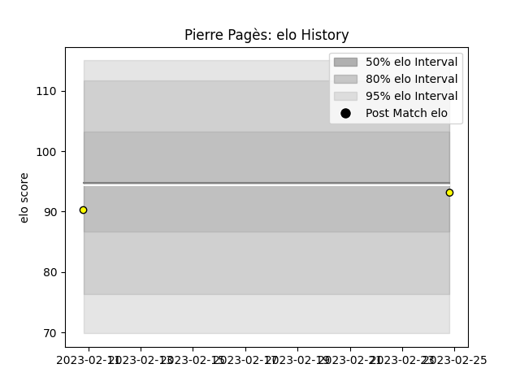

---  
layout: page  
title: Pierre PAGèS  
date: 2023-02-16 11:18:59.976531  
categories: player  
---
# Pierre PAGèS

## Positions: SH

## Current elo: 106.0

## Current Percentile: 64.0

# Elo History

# Match History

| Team             |   Appearances |   Win Rate |
|:-----------------|--------------:|-----------:|
| Vannes           |            33 |   0.545455 |
| Stade Toulousain |            31 |   0.693548 |
| Carcassonne      |             8 |   0.125    |
| Albi             |             1 |   0        |

| Opponent                   |   Matches |   Win Rate |
|:---------------------------|----------:|-----------:|
| Grenoble                   |         6 |   0.5      |
| Montpellier Herault        |         6 |   0.666667 |
| Agen                       |         4 |   0.75     |
| Rouen                      |         4 |   0.5      |
| Aurillac                   |         4 |   0.5      |
| Racing 92                  |         3 |   0.666667 |
| Mont-de-Marsan             |         3 |   1        |
| Bordeaux Begles            |         3 |   0.666667 |
| Bayonne                    |         3 |   0.333333 |
| Carcassonne                |         2 |   0.75     |
| Valence Romans Drome Rugby |         2 |   0.5      |
| US Bressane                |         2 |   1        |
| Provence Rugby             |         2 |   0        |
| Perpignan                  |         2 |   0        |
| Nevers                     |         2 |   1        |
| Castres Olympique          |         2 |   0.5      |
| Biarritz Olympique         |         2 |   0.5      |
| Narbonne                   |         2 |   0.75     |
| Lyon                       |         2 |   0.5      |
| La Rochelle                |         2 |   0.5      |
| Clermont Auvergne          |         2 |   0.75     |
| Montauban                  |         1 |   0        |
| Massy                      |         1 |   0        |
| Oyonnax                    |         1 |   0        |
| Pau                        |         1 |   1        |
| Bourgoin-Jallieu           |         1 |   0        |
| Gloucester Rugby           |         1 |   1        |
| Beziers                    |         1 |   0        |
| Connacht                   |         1 |   1        |
| Soyaux-Angouleme           |         1 |   0        |
| Stade Francais Paris       |         1 |   1        |
| Toulon                     |         1 |   0        |
| Colomiers                  |         1 |   1        |
| Vannes                     |         1 |   0        |