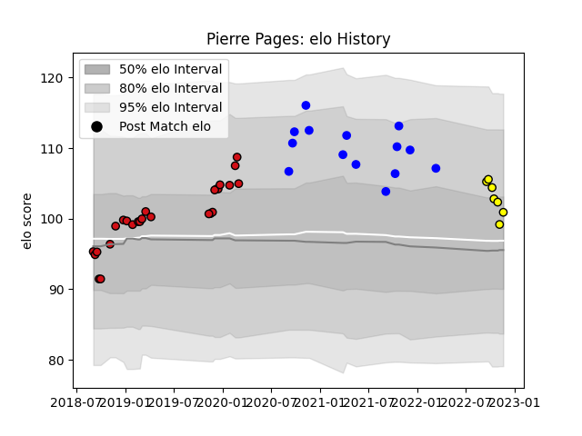

---  
layout: page  
title: Pierre Pages  
date: 2022-11-22 11:36:29.549624  
categories: player  
---
# Pierre Pages

## Positions: SH

## Current elo: 101.0

## Current Percentile: 64.0

# Elo History

# Match History

| Team             |   Appearances |   Win Rate |
|:-----------------|--------------:|-----------:|
| Stade Toulousain |            26 |   0.788462 |
| Vannes           |            14 |   0.571429 |
| Carcassonne      |             7 |   0.142857 |

| Opponent                   |   Matches |   Win Rate |
|:---------------------------|----------:|-----------:|
| Montpellier Herault        |         5 |   0.8      |
| Grenoble                   |         4 |   0.5      |
| Agen                       |         3 |   1        |
| Racing 92                  |         3 |   0.666667 |
| Bayonne                    |         2 |   0.5      |
| Biarritz Olympique         |         2 |   0.5      |
| Bordeaux Begles            |         2 |   1        |
| Carcassonne                |         2 |   0.75     |
| Clermont Auvergne          |         2 |   0.75     |
| Perpignan                  |         2 |   0        |
| Oyonnax                    |         1 |   0        |
| Pau                        |         1 |   1        |
| Stade Francais Paris       |         1 |   1        |
| Rouen                      |         1 |   1        |
| Soyaux-Angouleme           |         1 |   0        |
| Toulon                     |         1 |   0        |
| Valence Romans Drome Rugby |         1 |   1        |
| Narbonne                   |         1 |   0.5      |
| Massy                      |         1 |   0        |
| Montauban                  |         1 |   0        |
| Mont-de-Marsan             |         1 |   1        |
| Aurillac                   |         1 |   1        |
| Lyon                       |         1 |   1        |
| La Rochelle                |         1 |   1        |
| Gloucester Rugby           |         1 |   1        |
| Connacht                   |         1 |   1        |
| Colomiers                  |         1 |   1        |
| Castres Olympique          |         1 |   0        |
| Beziers                    |         1 |   0        |
| Vannes                     |         1 |   0        |