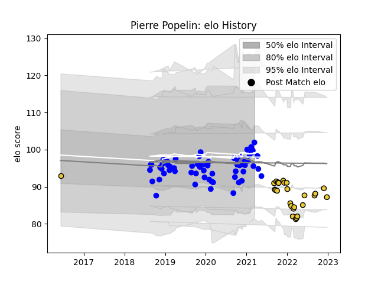

---  
layout: page  
title: Pierre Popelin  
date: 2022-12-31 16:26:47.662240  
categories: player  
---
# Pierre Popelin

## Positions: FB, FH

## Current elo: 102.0

## Current Percentile: 44.0

# Elo History

# Match History

| Team        |   Appearances |   Win Rate |
|:------------|--------------:|-----------:|
| Vannes      |            63 |   0.611111 |
| La Rochelle |            26 |   0.576923 |

| Opponent                   |   Matches |   Win Rate |
|:---------------------------|----------:|-----------:|
| Biarritz Olympique         |         7 |   0.428571 |
| Soyaux-Angouleme           |         6 |   0.666667 |
| Provence Rugby             |         6 |   0.5      |
| Aurillac                   |         5 |   0.8      |
| Nevers                     |         5 |   0.7      |
| Colomiers                  |         5 |   0.6      |
| Montauban                  |         5 |   0.6      |
| Mont-de-Marsan             |         4 |   0.75     |
| Rouen                      |         3 |   0.666667 |
| Perpignan                  |         3 |   0        |
| Oyonnax                    |         3 |   0.666667 |
| Montpellier Herault        |         3 |   0.333333 |
| Lyon                       |         3 |   1        |
| Clermont Auvergne          |         3 |   0.333333 |
| Castres Olympique          |         3 |   0.666667 |
| Carcassonne                |         3 |   0.166667 |
| Bordeaux Begles            |         2 |   0.5      |
| US Bressane                |         2 |   0.75     |
| Stade Francais Paris       |         2 |   0.5      |
| Beziers                    |         2 |   1        |
| Racing 92                  |         2 |   0.5      |
| Grenoble                   |         2 |   1        |
| Brive                      |         2 |   1        |
| Pau                        |         2 |   1        |
| Bayonne                    |         2 |   0.5      |
| Roval Drome XV             |         1 |   1        |
| Stade Toulousain           |         1 |   0        |
| Toulon                     |         1 |   0        |
| Valence Romans Drome Rugby |         1 |   1        |