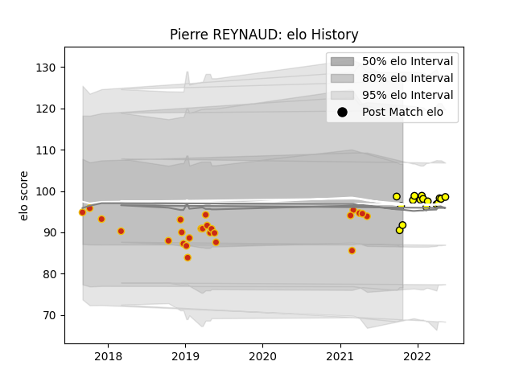

---  
layout: page  
title: Pierre REYNAUD  
date: 2023-02-16 16:41:06.423916  
categories: player  
---
# Pierre REYNAUD

## Positions: FL, N8

## Current elo: 117.0

## Current Percentile: 79.0

# Elo History

# Match History

| Team        |   Appearances |   Win Rate |
|:------------|--------------:|-----------:|
| Perpignan   |            25 |       0.3  |
| Carcassonne |            20 |       0.55 |

| Opponent                   |   Matches |   Win Rate |
|:---------------------------|----------:|-----------:|
| Aurillac                   |         4 |   0.375    |
| Nevers                     |         4 |   0.5      |
| Grenoble                   |         3 |   0.5      |
| Rouen                      |         3 |   0.666667 |
| Oyonnax                    |         2 |   0.5      |
| Bordeaux Begles            |         2 |   0        |
| US Bressane                |         2 |   1        |
| Connacht                   |         2 |   0        |
| Sale Sharks                |         2 |   0        |
| Racing 92                  |         2 |   0        |
| Beziers                    |         2 |   1        |
| Provence Rugby             |         2 |   0        |
| Valence Romans Drome Rugby |         1 |   1        |
| Stade Toulousain           |         1 |   0        |
| Stade Francais Paris       |         1 |   0        |
| Soyaux-Angouleme           |         1 |   1        |
| Montauban                  |         1 |   1        |
| Narbonne                   |         1 |   1        |
| Massy                      |         1 |   0        |
| Lyon                       |         1 |   0        |
| La Rochelle                |         1 |   0        |
| Dax                        |         1 |   1        |
| Colomiers                  |         1 |   1        |
| Clermont Auvergne          |         1 |   0        |
| Castres Olympique          |         1 |   0        |
| Biarritz Olympique         |         1 |   0        |
| Vannes                     |         1 |   0.5      |