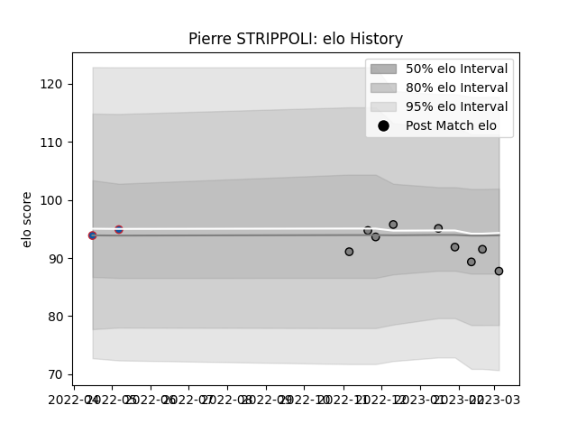

---  
layout: page  
title: Pierre STRIPPOLI  
date: 2023-02-16 11:19:43.823599  
categories: player  
---
# Pierre STRIPPOLI

## Positions: H

## Current elo: 88.0

## Current Percentile: 49.0

# Elo History

# Match History

| Team     |   Appearances |   Win Rate |
|:---------|--------------:|-----------:|
| Rennes   |             7 |   0.142857 |
| Grenoble |             2 |   0.25     |

| Opponent            |   Matches |   Win Rate |
|:--------------------|----------:|-----------:|
| Narbonne            |         2 |       0.25 |
| Albi                |         1 |       0    |
| Bourgoin-Jallieu    |         1 |       0    |
| Carqueiranne-Hyères |         1 |       1    |
| Dax                 |         1 |       0    |
| Mont-de-Marsan      |         1 |       0    |
| Tarbes              |         1 |       0    |
| US Bressane         |         1 |       0    |