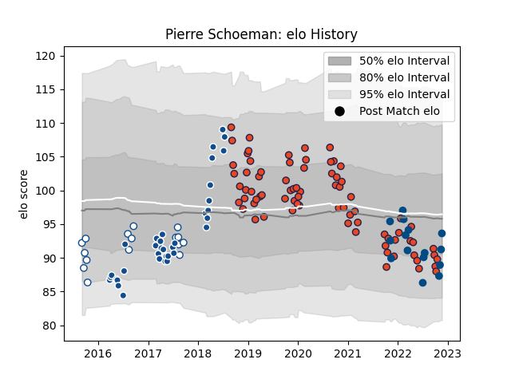

---  
layout: page  
title: Pierre Schoeman  
date: 2022-11-22 11:41:20.026739  
categories: player  
---
# Pierre Schoeman

## Positions: P

## Country: Scotland

## Current elo: 94.0

## Current Percentile: 27.0

# Elo History

# Match History

| Team       |   Appearances |   Win Rate |
|:-----------|--------------:|-----------:|
| Edinburgh  |            76 |   0.565789 |
| Bulls      |            35 |   0.428571 |
| Blue Bulls |            16 |   0.5625   |
| Scotland   |            15 |   0.466667 |

| Opponent                 |   Matches |   Win Rate |
|:-------------------------|----------:|-----------:|
| Glasgow Warriors         |        10 |   0.6      |
| Stormers                 |         7 |   0.357143 |
| Scarlets                 |         7 |   0.857143 |
| Lions                    |         6 |   0        |
| Zebre                    |         5 |   0.8      |
| Benetton Treviso         |         5 |   0.4      |
| Ulster                   |         5 |   0        |
| Sunwolves                |         5 |   0.6      |
| Southern Kings           |         5 |   0.6      |
| Cardiff Blues            |         5 |   0.8      |
| Dragons                  |         4 |   0.75     |
| Argentina                |         4 |   0.5      |
| Cheetahs                 |         4 |   0.75     |
| Munster                  |         4 |   0.25     |
| Connacht                 |         4 |   0.75     |
| Western Province         |         4 |   0.25     |
| Jaguares                 |         3 |   0.666667 |
| Golden Lions             |         3 |   0.666667 |
| Leinster                 |         3 |   0.333333 |
| Free State Cheetahs      |         3 |   0.333333 |
| Bordeaux Begles          |         3 |   0.166667 |
| Crusaders                |         2 |   0        |
| Australia                |         2 |   0.5      |
| Bulls                    |         2 |   0.5      |
| Sharks                   |         2 |   1        |
| Chiefs                   |         2 |   0        |
| Newcastle Falcons        |         2 |   1        |
| Natal Sharks             |         2 |   0.5      |
| Ospreys                  |         2 |   0        |
| Griquas                  |         2 |   1        |
| Hurricanes               |         2 |   0.5      |
| Melbourne Rebels         |         1 |   1        |
| Ireland                  |         1 |   0        |
| Wasps                    |         1 |   1        |
| Wales                    |         1 |   0        |
| Blues                    |         1 |   0        |
| Toulon                   |         1 |   1        |
| Tonga                    |         1 |   1        |
| Highlanders              |         1 |   0        |
| Brive                    |         1 |   1        |
| South Africa             |         1 |   0        |
| Italy                    |         1 |   1        |
| Montpellier Herault      |         1 |   1        |
| Saracens                 |         1 |   1        |
| Queensland Reds          |         1 |   0        |
| Pumas                    |         1 |   1        |
| Pau                      |         1 |   1        |
| France                   |         1 |   0        |
| Fiji                     |         1 |   1        |
| New Zealand              |         1 |   0        |
| New South Wales Waratahs |         1 |   0        |
| England                  |         1 |   1        |
| Eastern Province Kings   |         1 |   1        |
| Agen                     |         1 |   1        |