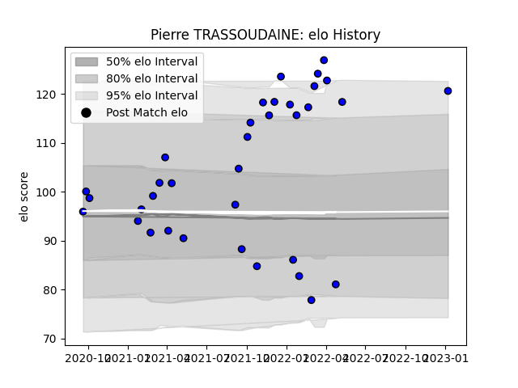

---  
layout: page  
title: Pierre TRASSOUDAINE  
date: 2023-01-23 15:35:11.725603  
categories: player  
---
# Pierre TRASSOUDAINE

## Positions: H

## Current elo: 122.0

## Current Percentile: 94.0

# Elo History

# Match History

| Team   |   Appearances |   Win Rate |
|:-------|--------------:|-----------:|
| Massy  |            36 |   0.708333 |

| Opponent                   |   Matches |   Win Rate |
|:---------------------------|----------:|-----------:|
| Aubenas                    |         4 |   1        |
| Bourgoin-Jallieu           |         4 |   0.75     |
| Chambery                   |         3 |   0.5      |
| Dax                        |         3 |   1        |
| Nice                       |         3 |   0.333333 |
| Albi                       |         2 |   0.5      |
| Blagnac                    |         2 |   0.5      |
| Cognac Saint Jean d'Angély |         2 |   1        |
| Dijon                      |         2 |   0.5      |
| Soyaux-Angouleme           |         2 |   0.5      |
| Suresnes                   |         2 |   1        |
| Tarbes                     |         2 |   1        |
| Valence Romans Drome Rugby |         2 |   1        |
| Mont-de-Marsan             |         1 |   0        |
| US Bressane                |         1 |   0        |
| Vannes                     |         1 |   1        |