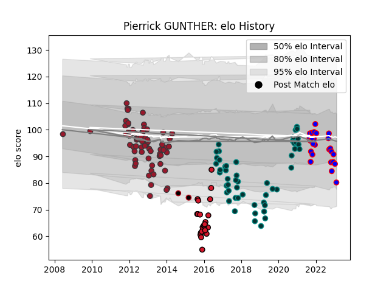

---  
layout: page  
title: Pierrick GUNTHER  
date: 2023-03-04 11:39:15.439263  
categories: player  
---
# Pierrick GUNTHER

## Positions: FL

## Current elo: 86.0

## Current Percentile: 14.0

# Elo History

# Match History

| Team    |   Appearances |   Win Rate |
|:--------|--------------:|-----------:|
| Toulon  |            70 |   0.685714 |
| Pau     |            51 |   0.362745 |
| Beziers |            22 |   0.409091 |
| Oyonnax |            22 |   0.272727 |
| Lyon    |             2 |   0        |

| Opponent             |   Matches |   Win Rate |
|:---------------------|----------:|-----------:|
| Stade Toulousain     |        13 |   0.230769 |
| Castres Olympique    |        11 |   0.454545 |
| Montpellier Herault  |        11 |   0.409091 |
| Racing 92            |        11 |   0.636364 |
| Stade Francais Paris |        10 |   0.5      |
| Clermont Auvergne    |         9 |   0.222222 |
| Agen                 |         8 |   0.875    |
| Brive                |         7 |   0.571429 |
| Bordeaux Begles      |         7 |   0.714286 |
| Toulon               |         6 |   0        |
| Grenoble             |         6 |   0.5      |
| La Rochelle          |         6 |   0.166667 |
| Bayonne              |         6 |   0.583333 |
| Lyon                 |         6 |   0.666667 |
| Perpignan            |         5 |   0.9      |
| Cardiff Blues        |         4 |   0.75     |
| Biarritz Olympique   |         4 |   0.5      |
| Mont-de-Marsan       |         4 |   0.75     |
| Oyonnax              |         3 |   0.666667 |
| Provence Rugby       |         3 |   0        |
| Sale Sharks          |         2 |   1        |
| Ulster               |         2 |   0        |
| Pau                  |         2 |   0.5      |
| Montauban            |         2 |   0.5      |
| Newcastle Falcons    |         2 |   0.5      |
| Nevers               |         2 |   0.5      |
| Aurillac             |         2 |   0.5      |
| Colomiers            |         2 |   0.5      |
| Narbonne             |         1 |   1        |
| Petrarca Padova      |         1 |   1        |
| London Irish         |         1 |   0        |
| Rouen                |         1 |   1        |
| Leicester Tigers     |         1 |   0        |
| Harlequins           |         1 |   1        |
| Carcassonne          |         1 |   0        |
| US Bressane          |         1 |   0        |
| Bath Rugby           |         1 |   0        |
| Vannes               |         1 |   0        |
| Zebre                |         1 |   1        |