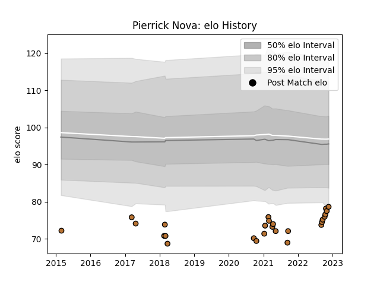

---  
layout: page  
title: Pierrick Nova  
date: 2022-12-09 13:07:01.059950  
categories: player  
---
# Pierrick Nova

## Positions: SH

## Current elo: 81.0

## Current Percentile: 5.0

# Elo History

# Match History

| Team     |   Appearances |   Win Rate |
|:---------|--------------:|-----------:|
| Narbonne |            28 |        0.5 |

| Opponent                   |   Matches |   Win Rate |
|:---------------------------|----------:|-----------:|
| Tarbes                     |         3 |   0.666667 |
| Blagnac                    |         3 |   0.833333 |
| Bourgoin-Jallieu           |         2 |   0.5      |
| Chambery                   |         2 |   0        |
| Dax                        |         2 |   0.5      |
| Biarritz Olympique         |         1 |   0        |
| Nice                       |         1 |   1        |
| US Bressane                |         1 |   1        |
| Suresnes                   |         1 |   1        |
| Rennes                     |         1 |   1        |
| Provence Rugby             |         1 |   1        |
| Oyonnax                    |         1 |   0        |
| Mont-de-Marsan             |         1 |   0        |
| Nevers                     |         1 |   0        |
| Montauban                  |         1 |   0        |
| Massy                      |         1 |   0        |
| Grenoble                   |         1 |   0.5      |
| Cognac Saint Jean d'Angély |         1 |   1        |
| Carqueiranne-Hyères        |         1 |   1        |
| Carcassonne                |         1 |   0        |
| Valence Romans Drome Rugby |         1 |   0        |