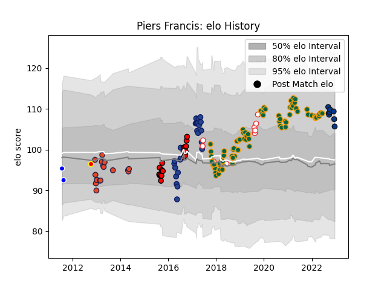

---  
layout: page  
title: Piers Francis  
date: 2023-01-17 11:28:40.970483  
categories: player  
---
# Piers Francis

## Positions: C, FH

## Country: England

## Current elo: 117.0

## Current Percentile: 86.0

# Elo History

# Match History

| Team               |   Appearances |   Win Rate |
|:-------------------|--------------:|-----------:|
| Northampton Saints |            78 |   0.384615 |
| Blues              |            24 |   0.5625   |
| Counties Manukau   |            19 |   0.526316 |
| Edinburgh          |            18 |   0.166667 |
| England            |            10 |   0.7      |
| Bath Rugby         |             9 |   0        |
| Auckland           |             2 |   0.5      |
| Waikato            |             1 |   1        |

| Opponent                 |   Matches |   Win Rate |
|:-------------------------|----------:|-----------:|
| Sale Sharks              |         9 |   0.222222 |
| Wasps                    |         9 |   0.555556 |
| Gloucester Rugby         |         8 |   0.25     |
| Exeter Chiefs            |         8 |   0.25     |
| Bath Rugby               |         7 |   0.285714 |
| Harlequins               |         7 |   0.571429 |
| Worcester Warriors       |         6 |   0.833333 |
| Saracens                 |         6 |   0        |
| Bristol Rugby            |         6 |   0.166667 |
| London Irish             |         4 |   0.5      |
| Leicester Tigers         |         4 |   0.75     |
| Glasgow Warriors         |         4 |   0        |
| Leinster                 |         3 |   0        |
| Clermont Auvergne        |         3 |   0        |
| Munster                  |         3 |   0        |
| Tasman                   |         3 |   0.333333 |
| Chiefs                   |         3 |   0.166667 |
| Newcastle Falcons        |         3 |   0        |
| Ospreys                  |         3 |   0        |
| Melbourne Rebels         |         2 |   1        |
| Auckland                 |         2 |   0.5      |
| New South Wales Waratahs |         2 |   1        |
| North Harbour            |         2 |   0        |
| Racing 92                |         2 |   0        |
| Taranaki                 |         2 |   0        |
| Argentina                |         2 |   1        |
| Toulon                   |         2 |   0        |
| Hurricanes               |         2 |   0        |
| Western Force            |         2 |   1        |
| Wellington               |         2 |   0.5      |
| Wales                    |         2 |   0.5      |
| Canterbury               |         2 |   0.5      |
| Waikato                  |         2 |   1        |
| Crusaders                |         2 |   0        |
| Dragons                  |         2 |   1        |
| Hawke's Bay              |         2 |   0.5      |
| Highlanders              |         2 |   0        |
| Ulster                   |         1 |   1        |
| United States of America |         1 |   1        |
| Southern Kings           |         1 |   1        |
| South Africa             |         1 |   0        |
| Stormers                 |         1 |   0        |
| Sharks                   |         1 |   1        |
| Scarlets                 |         1 |   0        |
| Lyon                     |         1 |   1        |
| Samoa                    |         1 |   1        |
| Queensland Reds          |         1 |   1        |
| Barbarians               |         1 |   0        |
| Bay of Plenty            |         1 |   1        |
| Benetton Treviso         |         1 |   0        |
| Brumbies                 |         1 |   1        |
| Bulls                    |         1 |   1        |
| Cheetahs                 |         1 |   1        |
| Connacht                 |         1 |   0        |
| Counties Manukau         |         1 |   1        |
| Ireland                  |         1 |   1        |
| Italy                    |         1 |   1        |
| Jaguares                 |         1 |   1        |
| Lions                    |         1 |   0        |
| Manawatu                 |         1 |   1        |
| Northland                |         1 |   1        |
| Otago                    |         1 |   1        |
| Zebre                    |         1 |   1        |