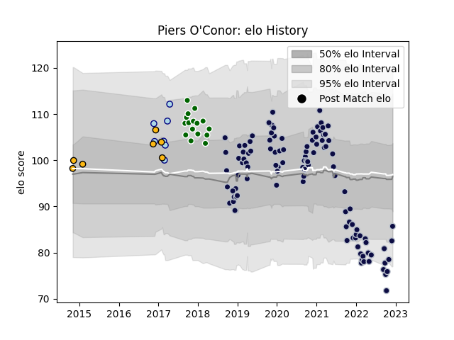

---  
layout: page  
title: Piers O'Conor  
date: 2022-12-12 15:11:11.173789  
categories: player  
---
# Piers O'Conor

## Positions: C, FB

## Current elo: 86.0

## Current Percentile: 11.0

# Elo History

# Match History

| Team                |   Appearances |   Win Rate |
|:--------------------|--------------:|-----------:|
| Bristol Rugby       |           106 |   0.54717  |
| Ealing Trailfinders |            16 |   0.875    |
| Bedford             |             7 |   0.642857 |
| Wasps               |             7 |   0.428571 |

| Opponent             |   Matches |   Win Rate |
|:---------------------|----------:|-----------:|
| Wasps                |        10 |   0.3      |
| Exeter Chiefs        |        10 |   0.3      |
| Leicester Tigers     |         9 |   0.611111 |
| Worcester Warriors   |         9 |   0.777778 |
| Sale Sharks          |         9 |   0.277778 |
| Northampton Saints   |         9 |   0.555556 |
| Harlequins           |         8 |   0.375    |
| Bath Rugby           |         7 |   0.714286 |
| Gloucester Rugby     |         7 |   0.571429 |
| London Irish         |         7 |   0.714286 |
| Newcastle Falcons    |         6 |   0.833333 |
| Saracens             |         5 |   0.2      |
| Stade Francais Paris |         3 |   1        |
| Rotherham Titans     |         3 |   1        |
| Nottingham           |         3 |   0.666667 |
| London Scottish      |         3 |   0.666667 |
| La Rochelle          |         3 |   0.333333 |
| RC Enisei            |         2 |   1        |
| Brive                |         2 |   1        |
| Cornish Pirates      |         2 |   0.75     |
| Bedford              |         2 |   1        |
| Richmond             |         2 |   1        |
| Zebre                |         2 |   0.5      |
| Hartpury College     |         2 |   1        |
| Jersey               |         2 |   1        |
| Ospreys              |         1 |   0        |
| Ealing Trailfinders  |         1 |   0        |
| Cardiff Blues        |         1 |   0        |
| London Welsh         |         1 |   1        |
| Toulon               |         1 |   1        |
| Bristol Rugby        |         1 |   0        |
| Bordeaux Begles      |         1 |   1        |
| Yorkshire Carnegie   |         1 |   1        |
| Dragons              |         1 |   1        |