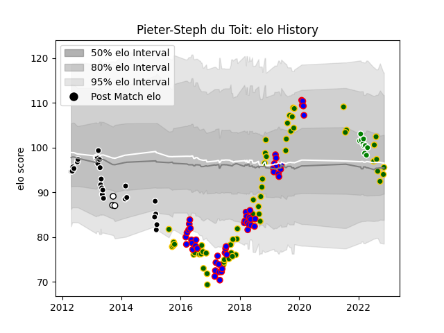

---  
layout: page  
title: Pieter-Steph du Toit  
date: 2023-01-13 11:30:21.415969  
categories: player  
---
# Pieter-Steph du Toit

## Positions: FL, L

## Country: South Africa

## Current elo: 96.0

## Current Percentile: 21.0

# Elo History

# Match History

| Team            |   Appearances |   Win Rate |
|:----------------|--------------:|-----------:|
| South Africa    |            67 |   0.559701 |
| Stormers        |            54 |   0.555556 |
| Sharks          |            27 |   0.592593 |
| Toyota Verblitz |            13 |   0.461538 |
| Natal Sharks    |             3 |   0.666667 |

| Opponent                          |   Matches |   Win Rate |
|:----------------------------------|----------:|-----------:|
| Bulls                             |        12 |   0.583333 |
| Argentina                         |        10 |   0.7      |
| New Zealand                       |        10 |   0.25     |
| Cheetahs                          |         9 |   0.777778 |
| Wales                             |         9 |   0.444444 |
| Australia                         |         8 |   0.5      |
| Lions                             |         7 |   0.571429 |
| England                           |         6 |   0.5      |
| France                            |         6 |   0.833333 |
| Chiefs                            |         5 |   0        |
| Sharks                            |         5 |   0.4      |
| Ireland                           |         5 |   0.4      |
| Sunwolves                         |         4 |   0.625    |
| Stormers                          |         4 |   0.5      |
| Blues                             |         4 |   0.5      |
| Jaguares                          |         4 |   0.75     |
| Highlanders                       |         4 |   0.5      |
| Crusaders                         |         4 |   0.375    |
| Queensland Reds                   |         3 |   0.666667 |
| Western Force                     |         3 |   1        |
| Melbourne Rebels                  |         3 |   1        |
| Japan                             |         3 |   0.666667 |
| Italy                             |         3 |   0.666667 |
| Hurricanes                        |         3 |   0.666667 |
| Brumbies                          |         3 |   0.333333 |
| Scotland                          |         2 |   1        |
| Black Rams Tokyo                  |         2 |   0.5      |
| British and Irish Lions           |         2 |   0.5      |
| Toshiba Brave Lupus Tokyo         |         2 |   0.5      |
| Southern Kings                    |         2 |   1        |
| Shizuoka Blue Revs                |         2 |   1        |
| New South Wales Waratahs          |         2 |   0        |
| Saitama Wild Knights              |         1 |   0        |
| Free State Cheetahs               |         1 |   1        |
| Kubota Spears Funabashi Tokyo-Bay |         1 |   0        |
| Georgia                           |         1 |   1        |
| Canada                            |         1 |   1        |
| Green Rockets Tokatsu             |         1 |   1        |
| Tokyo Sungoliath                  |         1 |   0        |
| United States of America          |         1 |   1        |
| Urayasu D-Rocks                   |         1 |   1        |
| Mitsubishi Dynaboars              |         1 |   0        |
| Griquas                           |         1 |   1        |
| Western Province                  |         1 |   0        |
| Yokohama Canon Eagles             |         1 |   0        |