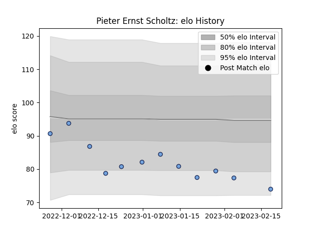

---  
layout: page  
title: Pieter Ernst Scholtz  
date: 2023-02-24 02:27:49.939441  
categories: player  
---
# Pieter Ernst Scholtz

## Positions: P

## Current elo: 74.0

## Current Percentile: 7.0

# Elo History

# Match History

| Team    |   Appearances |   Win Rate |
|:--------|--------------:|-----------:|
| Bayonne |            12 |      0.375 |

| Opponent             |   Matches |   Win Rate |
|:---------------------|----------:|-----------:|
| Benetton Treviso     |         2 |        0   |
| Scarlets             |         2 |        0   |
| Bordeaux Begles      |         1 |        0   |
| Brive                |         1 |        1   |
| Lyon                 |         1 |        1   |
| Montpellier Herault  |         1 |        0   |
| Pau                  |         1 |        0.5 |
| Stade Francais Paris |         1 |        1   |
| Stade Toulousain     |         1 |        0   |
| Toulon               |         1 |        1   |