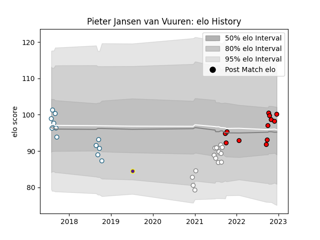

---  
layout: page  
title: Pieter Jansen van Vuuren  
date: 2023-01-06 00:26:49.279917  
categories: player  
---
# Pieter Jansen van Vuuren

## Positions: L

## Current elo: 102.0

## Current Percentile: 33.0

# Elo History

# Match History

| Team     |   Appearances |   Win Rate |
|:---------|--------------:|-----------:|
| Lions    |            14 |   0.428571 |
| Pumas    |            14 |   0.428571 |
| Griquas  |            13 |   0.153846 |
| Griffons |             1 |   0        |

| Opponent             |   Matches |   Win Rate |
|:---------------------|----------:|-----------:|
| Golden Lions         |         6 |   0.333333 |
| Blue Bulls           |         5 |   0.2      |
| Western Province     |         5 |   0.3      |
| Free State Cheetahs  |         4 |   0.5      |
| Natal Sharks         |         3 |   0        |
| Griquas              |         2 |   0.75     |
| Pumas                |         2 |   0        |
| Sharks               |         2 |   0        |
| Stormers             |         2 |   0        |
| Edinburgh            |         1 |   1        |
| Glasgow Warriors     |         1 |   0        |
| Dragons              |         1 |   1        |
| Jaguares XV          |         1 |   0        |
| Bulls                |         1 |   0        |
| Ospreys              |         1 |   1        |
| Scarlets             |         1 |   0        |
| Stade Francais Paris |         1 |   1        |
| Ulster               |         1 |   0        |
| Cardiff Blues        |         1 |   1        |
| Zebre                |         1 |   1        |