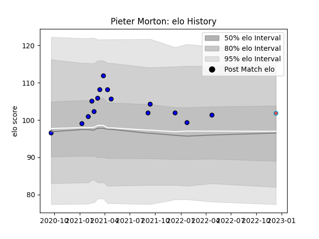

---  
layout: page  
title: Pieter Morton  
date: 2023-01-15 11:43:50.750546  
categories: player  
---
# Pieter Morton

## Positions: C

## Current elo: 94.0

## Current Percentile: 41.0

# Elo History

# Match History

| Team             |   Appearances |   Win Rate |
|:-----------------|--------------:|-----------:|
| Massy            |            17 |   0.588235 |
| Bourgoin-Jallieu |             2 |   0.5      |

| Opponent                   |   Matches |   Win Rate |
|:---------------------------|----------:|-----------:|
| Blagnac                    |         4 |        0.5 |
| Bourgoin-Jallieu           |         2 |        0.5 |
| Chambery                   |         2 |        0.5 |
| Suresnes                   |         2 |        1   |
| Albi                       |         1 |        0   |
| Aubenas                    |         1 |        1   |
| Cognac Saint Jean d'Angély |         1 |        1   |
| Dax                        |         1 |        1   |
| Narbonne                   |         1 |        0   |
| Nice                       |         1 |        0   |
| Rennes                     |         1 |        1   |
| Soyaux-Angouleme           |         1 |        0   |
| US Bressane                |         1 |        1   |