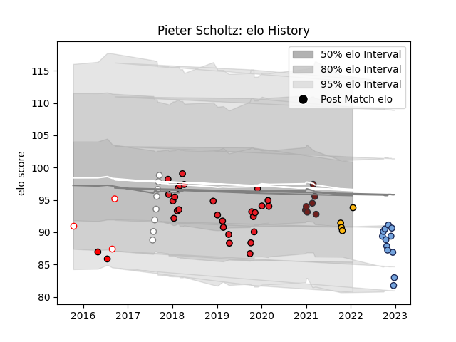

---  
layout: page  
title: Pieter Scholtz  
date: 2022-12-18 16:16:34.948099  
categories: player  
---
# Pieter Scholtz

## Positions: P

## Current elo: 83.0

## Current Percentile: 17.0

# Elo History

# Match History

| Team           |   Appearances |   Win Rate |
|:---------------|--------------:|-----------:|
| Southern Kings |            26 |  0.0961538 |
| Bayonne        |            11 |  0.545455  |
| Pumas          |             8 |  0.5       |
| Scarlets       |             7 |  0.714286  |
| Wasps          |             3 |  0.333333  |
| Golden Lions   |             2 |  1         |
| Lions          |             2 |  0         |

| Opponent             |   Matches |   Win Rate |
|:---------------------|----------:|-----------:|
| Benetton Treviso     |         5 |   0.2      |
| Edinburgh            |         5 |   0.2      |
| Munster              |         4 |   0        |
| Ospreys              |         4 |   0.5      |
| Scarlets             |         3 |   0        |
| Connacht             |         3 |   0.333333 |
| Dragons              |         3 |   0.833333 |
| Leinster             |         2 |   0        |
| Golden Lions         |         2 |   0.5      |
| Cardiff Blues        |         2 |   0        |
| Cheetahs             |         2 |   0        |
| Natal Sharks         |         2 |   0        |
| Griquas              |         2 |   1        |
| Northampton Saints   |         1 |   1        |
| Ulster               |         1 |   0        |
| Perpignan            |         1 |   1        |
| Stade Toulousain     |         1 |   1        |
| Montpellier Herault  |         1 |   0        |
| Stade Francais Paris |         1 |   0        |
| Saracens             |         1 |   0        |
| Hurricanes           |         1 |   0        |
| Lyon                 |         1 |   1        |
| La Rochelle          |         1 |   1        |
| Jaguares             |         1 |   0        |
| Blue Bulls           |         1 |   1        |
| Glasgow Warriors     |         1 |   0        |
| Free State Cheetahs  |         1 |   0        |
| Exeter Chiefs        |         1 |   0        |
| Clermont Auvergne    |         1 |   1        |
| Castres Olympique    |         1 |   0        |
| Bordeaux Begles      |         1 |   1        |
| Boland Cavaliers     |         1 |   1        |
| Western Province     |         1 |   1        |