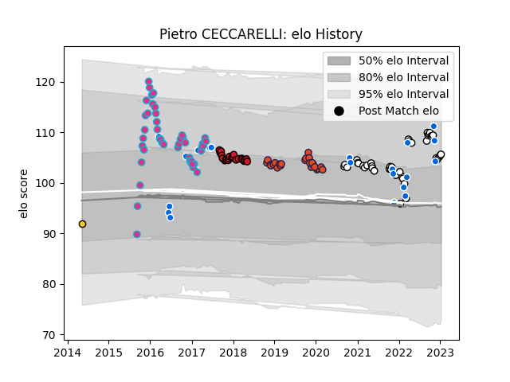

---  
layout: page  
title: Pietro CECCARELLI  
date: 2023-01-31 16:08:10.419190  
categories: player  
---
# Pietro CECCARELLI

## Positions: P

## Country: Italy

## Current elo: 106.0

## Current Percentile: 79.0

# Elo History

# Match History

| Team        |   Appearances |   Win Rate |
|:------------|--------------:|-----------:|
| Zebre       |            45 |   0.177778 |
| Brive       |            42 |   0.369048 |
| Edinburgh   |            23 |   0.586957 |
| Oyonnax     |            23 |   0.217391 |
| Italy       |            21 |   0.285714 |
| La Rochelle |             1 |   1        |

| Opponent                 |   Matches |   Win Rate |
|:-------------------------|----------:|-----------:|
| Cardiff Blues            |         8 |   0.5      |
| Lyon                     |         7 |   0.428571 |
| Bordeaux Begles          |         7 |   0.214286 |
| La Rochelle              |         7 |   0.357143 |
| Dragons                  |         6 |   0.5      |
| Scarlets                 |         6 |   0.5      |
| Castres Olympique        |         6 |   0.166667 |
| Montpellier Herault      |         5 |   0.3      |
| Connacht                 |         5 |   0.2      |
| Munster                  |         5 |   0.2      |
| Glasgow Warriors         |         5 |   0.2      |
| Benetton Treviso         |         5 |   0.2      |
| Stade Toulousain         |         5 |   0        |
| Racing 92                |         4 |   0        |
| Stade Francais Paris     |         4 |   0        |
| Toulon                   |         4 |   0.5      |
| Leinster                 |         4 |   0        |
| Pau                      |         4 |   0.5      |
| Agen                     |         4 |   0.75     |
| Edinburgh                |         4 |   0.25     |
| Clermont Auvergne        |         4 |   0.375    |
| Brive                    |         4 |   0.25     |
| Ireland                  |         3 |   0        |
| England                  |         3 |   0        |
| Wasps                    |         3 |   0.333333 |
| Bayonne                  |         3 |   0.666667 |
| Gloucester Rugby         |         2 |   0        |
| Worcester Warriors       |         2 |   1        |
| Wales                    |         2 |   0.5      |
| Ulster                   |         2 |   0        |
| Australia                |         2 |   0.5      |
| Southern Kings           |         2 |   0.5      |
| Scotland                 |         2 |   0        |
| Ospreys                  |         2 |   0        |
| New Zealand              |         2 |   0        |
| Argentina                |         2 |   0        |
| Zebre                    |         2 |   0.5      |
| South Africa             |         1 |   0        |
| Samoa                    |         1 |   1        |
| Biarritz Olympique       |         1 |   0        |
| Canada                   |         1 |   1        |
| Perpignan                |         1 |   1        |
| Carcassonne              |         1 |   1        |
| United States of America |         1 |   1        |
| Uruguay                  |         1 |   1        |