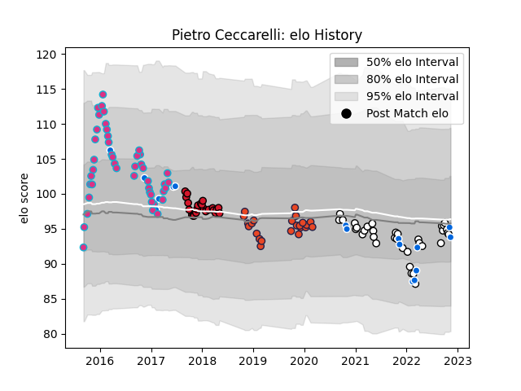

---  
layout: page  
title: Pietro Ceccarelli  
date: 2022-12-09 13:22:11.083808  
categories: player  
---
# Pietro Ceccarelli

## Positions: P

## Country: Italy

## Current elo: 92.0

## Current Percentile: 33.0

# Elo History

# Match History

| Team      |   Appearances |   Win Rate |
|:----------|--------------:|-----------:|
| Zebre     |            45 |   0.177778 |
| Brive     |            36 |   0.291667 |
| Edinburgh |            23 |   0.586957 |
| Oyonnax   |            23 |   0.217391 |
| Italy     |            17 |   0.176471 |

| Opponent             |   Matches |   Win Rate |
|:---------------------|----------:|-----------:|
| La Rochelle          |         7 |   0.357143 |
| Bordeaux Begles      |         7 |   0.214286 |
| Cardiff Blues        |         7 |   0.428571 |
| Lyon                 |         6 |   0.333333 |
| Scarlets             |         6 |   0.5      |
| Castres Olympique    |         6 |   0.166667 |
| Dragons              |         6 |   0.5      |
| Stade Toulousain     |         5 |   0        |
| Benetton Treviso     |         5 |   0.2      |
| Munster              |         5 |   0.2      |
| Connacht             |         5 |   0.2      |
| Montpellier Herault  |         5 |   0.3      |
| Glasgow Warriors     |         5 |   0.2      |
| Stade Francais Paris |         4 |   0        |
| Racing 92            |         4 |   0        |
| Leinster             |         4 |   0        |
| Agen                 |         4 |   0.75     |
| Edinburgh            |         4 |   0.25     |
| Brive                |         4 |   0.25     |
| Ireland              |         3 |   0        |
| England              |         3 |   0        |
| Clermont Auvergne    |         3 |   0.166667 |
| Wasps                |         3 |   0.333333 |
| Pau                  |         3 |   0.333333 |
| Toulon               |         3 |   0.333333 |
| Southern Kings       |         2 |   0.5      |
| Worcester Warriors   |         2 |   1        |
| Wales                |         2 |   0.5      |
| Ulster               |         2 |   0        |
| Australia            |         2 |   0.5      |
| Bayonne              |         2 |   1        |
| Zebre                |         2 |   0.5      |
| Scotland             |         2 |   0        |
| Gloucester Rugby     |         2 |   0        |
| Ospreys              |         2 |   0        |
| New Zealand          |         2 |   0        |
| South Africa         |         1 |   0        |
| Samoa                |         1 |   1        |
| Perpignan            |         1 |   1        |
| Argentina            |         1 |   0        |
| Biarritz Olympique   |         1 |   0        |