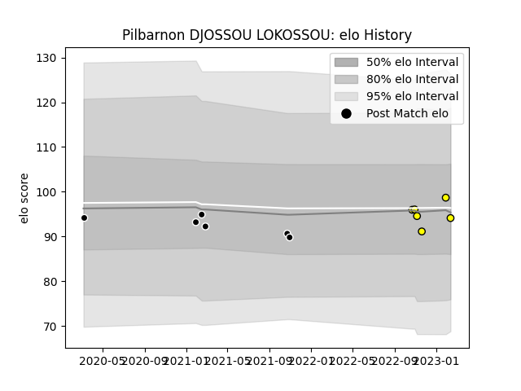

---  
layout: page  
title: Pilbarnon DJOSSOU LOKOSSOU  
date: 2023-02-05 17:56:44.465728  
categories: player  
---
# Pilbarnon DJOSSOU LOKOSSOU

## Positions: L

## Current elo: 99.0

## Current Percentile: 36.0

# Elo History

# Match History

| Team           |   Appearances |   Win Rate |
|:---------------|--------------:|-----------:|
| Provence Rugby |             6 |        0   |
| Albi           |             5 |        0.6 |

| Opponent                   |   Matches |   Win Rate |
|:---------------------------|----------:|-----------:|
| Aurillac                   |         1 |          0 |
| Bayonne                    |         1 |          0 |
| Beziers                    |         1 |          0 |
| Biarritz Olympique         |         1 |          0 |
| Colomiers                  |         1 |          0 |
| Dax                        |         1 |          1 |
| Narbonne                   |         1 |          1 |
| Suresnes                   |         1 |          0 |
| Tarbes                     |         1 |          0 |
| Valence Romans Drome Rugby |         1 |          1 |
| Vannes                     |         1 |          0 |