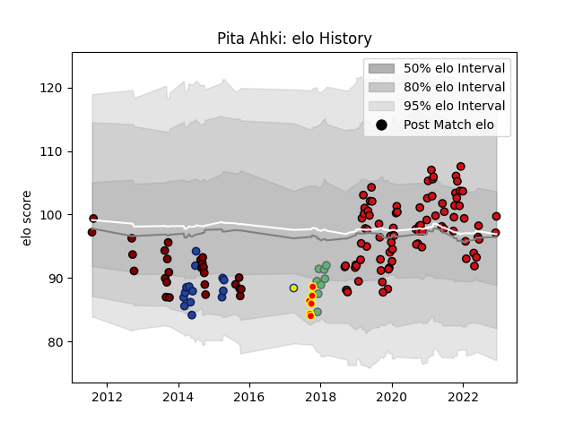

---  
layout: page  
title: Pita Ahki  
date: 2022-12-09 13:06:58.536449  
categories: player  
---
# Pita Ahki

## Positions: C

## Current elo: 97.0

## Current Percentile: 50.0

# Elo History

# Match History

| Team             |   Appearances |   Win Rate |
|:-----------------|--------------:|-----------:|
| Stade Toulousain |            85 |   0.688235 |
| North Harbour    |            26 |   0.173077 |
| Blues            |            14 |   0.428571 |
| Connacht         |             8 |   0.375    |
| Waikato          |             6 |   0        |
| Hurricanes       |             1 |   1        |

| Opponent                 |   Matches |   Win Rate |
|:-------------------------|----------:|-----------:|
| La Rochelle              |         9 |   0.888889 |
| Racing 92                |         8 |   0.625    |
| Montpellier Herault      |         7 |   0.714286 |
| Bordeaux Begles          |         7 |   0.714286 |
| Brive                    |         7 |   0.857143 |
| Manawatu                 |         6 |   0.166667 |
| Clermont Auvergne        |         6 |   0.583333 |
| Lyon                     |         5 |   0.2      |
| Pau                      |         5 |   1        |
| Castres Olympique        |         5 |   0.5      |
| Toulon                   |         5 |   0.5      |
| Perpignan                |         4 |   0.75     |
| Northland                |         4 |   0.375    |
| Southland                |         3 |   0        |
| Stade Francais Paris     |         3 |   0.666667 |
| Bay of Plenty            |         3 |   0        |
| Auckland                 |         3 |   0        |
| Agen                     |         3 |   1        |
| Highlanders              |         2 |   0.5      |
| Otago                    |         2 |   0        |
| New South Wales Waratahs |         2 |   0.5      |
| Wellington               |         2 |   0        |
| Zebre                    |         2 |   0        |
| Cardiff Blues            |         2 |   0.5      |
| Crusaders                |         2 |   0.5      |
| Hawke's Bay              |         2 |   0.5      |
| Chiefs                   |         2 |   0        |
| Connacht                 |         2 |   1        |
| Biarritz Olympique       |         2 |   1        |
| Counties Manukau         |         2 |   0        |
| Bayonne                  |         2 |   0.5      |
| Canterbury               |         2 |   0        |
| Ulster                   |         1 |   1        |
| Sharks                   |         1 |   0        |
| Waikato                  |         1 |   0        |
| Wasps                    |         1 |   0        |
| Tasman                   |         1 |   1        |
| Brumbies                 |         1 |   1        |
| Western Force            |         1 |   1        |
| Bulls                    |         1 |   0        |
| Hurricanes               |         1 |   1        |
| Queensland Reds          |         1 |   1        |
| Cheetahs                 |         1 |   0        |
| Ospreys                  |         1 |   1        |
| North Harbour            |         1 |   0        |
| Munster                  |         1 |   0        |
| Exeter Chiefs            |         1 |   0        |
| Gloucester Rugby         |         1 |   1        |
| Lions                    |         1 |   0        |
| Grenoble                 |         1 |   1        |
| Leinster                 |         1 |   0        |