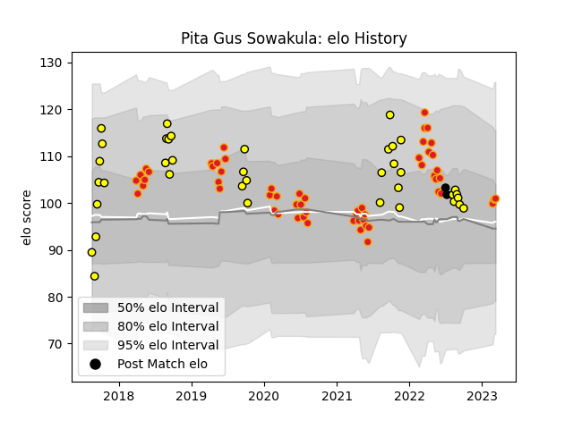

---  
layout: page  
title: Pita Gus Sowakula  
date: 2023-03-21 18:22:02.600099  
categories: player  
---
# Pita Gus Sowakula

Last updated: 2023-03-21
## Positions: N8, FL

## Country: New Zealand

## Current elo: 102.0

## Current Percentile: 65.0

# Elo History

# Match History

| Team        |   Appearances |   Win Rate |
|:------------|--------------:|-----------:|
| Chiefs      |            58 |   0.603448 |
| Taranaki    |            38 |   0.578947 |
| New Zealand |             2 |   0.5      |

| Opponent                 |   Matches |   Win Rate |
|:-------------------------|----------:|-----------:|
| Blues                    |        10 |   0.4      |
| Crusaders                |        10 |   0.5      |
| Highlanders              |         6 |   0.666667 |
| Hurricanes               |         5 |   0.4      |
| Waikato                  |         5 |   0.4      |
| New South Wales Waratahs |         4 |   1        |
| Melbourne Rebels         |         4 |   1        |
| Bay of Plenty            |         4 |   0.5      |
| Queensland Reds          |         4 |   0.75     |
| Auckland                 |         4 |   0.25     |
| Tasman                   |         4 |   0.25     |
| Northland                |         3 |   0.333333 |
| Southland                |         3 |   1        |
| Hawke's Bay              |         3 |   0.666667 |
| Moana Pasifika           |         3 |   1        |
| Brumbies                 |         3 |   0.333333 |
| Otago                    |         3 |   1        |
| Sharks                   |         2 |   0.5      |
| Wellington               |         2 |   0.5      |
| Manawatu                 |         2 |   1        |
| Jaguares                 |         2 |   0        |
| Ireland                  |         2 |   0.5      |
| Counties Manukau         |         2 |   1        |
| Canterbury               |         2 |   1        |
| Western Force            |         2 |   1        |
| North Harbour            |         1 |   0        |
| Lions                    |         1 |   0        |
| Stormers                 |         1 |   1        |
| Fijian Drua              |         1 |   1        |