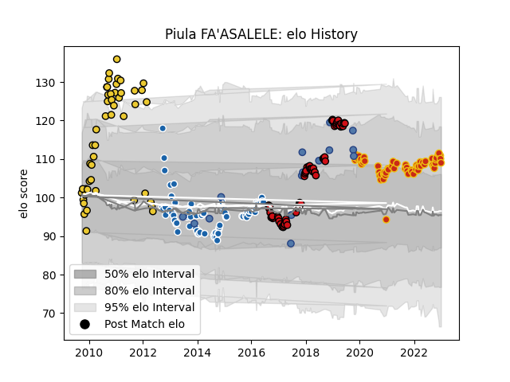

---  
layout: page  
title: Piula FA'ASALELE  
date: 2023-02-09 13:56:55.376000  
categories: player  
---
# Piula FA'ASALELE

## Positions: FL, L

## Country: Samoa

## Current elo: 122.0

## Current Percentile: 91.0

# Elo History

# Match History

| Team              |   Appearances |   Win Rate |
|:------------------|--------------:|-----------:|
| Castres Olympique |            80 |   0.4625   |
| Stade Toulousain  |            72 |   0.569444 |
| Perpignan         |            67 |   0.58209  |
| La Rochelle       |            48 |   0.479167 |
| Samoa             |            15 |   0.266667 |

| Opponent                   |   Matches |   Win Rate |
|:---------------------------|----------:|-----------:|
| Montpellier Herault        |        17 |   0.411765 |
| Toulon                     |        16 |   0.4375   |
| Clermont Auvergne          |        16 |   0.40625  |
| Racing 92                  |        14 |   0.571429 |
| Grenoble                   |        14 |   0.607143 |
| Brive                      |        12 |   0.5      |
| Agen                       |        11 |   0.818182 |
| Stade Francais Paris       |        11 |   0.545455 |
| La Rochelle                |        11 |   0.545455 |
| Pau                        |        10 |   0.35     |
| Lyon                       |        10 |   0.35     |
| Biarritz Olympique         |        10 |   0.55     |
| Bordeaux Begles            |        10 |   0.75     |
| Castres Olympique          |         8 |   0.375    |
| Stade Toulousain           |         8 |   0.25     |
| Oyonnax                    |         8 |   0.6875   |
| Aurillac                   |         6 |   0.5      |
| Perpignan                  |         6 |   0.666667 |
| Leinster                   |         5 |   0        |
| Mont-de-Marsan             |         4 |   0.75     |
| Bayonne                    |         4 |   0.25     |
| Italy                      |         3 |   0.666667 |
| Wasps                      |         3 |   0        |
| Colomiers                  |         3 |   0.333333 |
| Vannes                     |         3 |   1        |
| Northampton Saints         |         3 |   0.666667 |
| Provence Rugby             |         3 |   0.666667 |
| Carcassonne                |         2 |   0.5      |
| Rouen                      |         2 |   1        |
| Cardiff Blues              |         2 |   0        |
| Scotland                   |         2 |   0        |
| Auch                       |         2 |   1        |
| Ulster                     |         2 |   0        |
| Sale Sharks                |         2 |   0.75     |
| Nevers                     |         2 |   0.5      |
| Montauban                  |         2 |   1        |
| Georgia                    |         2 |   0        |
| Albi                       |         2 |   0.5      |
| Connacht                   |         2 |   0.5      |
| Lannemezan                 |         2 |   1        |
| Dax                        |         2 |   1        |
| Harlequins                 |         2 |   0        |
| Beziers                    |         1 |   0        |
| Tarbes                     |         1 |   1        |
| Spain                      |         1 |   1        |
| England                    |         1 |   0        |
| Valence Romans Drome Rugby |         1 |   1        |
| Dragons                    |         1 |   1        |
| Germany                    |         1 |   1        |
| Wales                      |         1 |   0        |
| Bourgoin-Jallieu           |         1 |   1        |
| Soyaux-Angouleme           |         1 |   1        |
| Roval Drome XV             |         1 |   1        |
| Glasgow Warriors           |         1 |   0        |
| Munster                    |         1 |   0        |
| Gloucester Rugby           |         1 |   1        |
| Romania                    |         1 |   0        |
| Bath Rugby                 |         1 |   1        |
| Périgueux                  |         1 |   1        |
| Ireland                    |         1 |   0        |
| Japan                      |         1 |   0        |
| Ospreys                    |         1 |   1        |
| New Zealand                |         1 |   0        |
| Narbonne                   |         1 |   0        |
| Zebre                      |         1 |   1        |